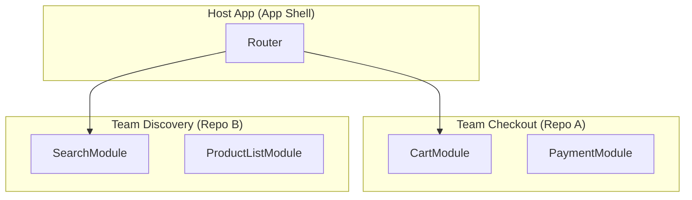

# Декомпозиция по командам

Декомпозиция по командам — это архитектурный подход, основанный на Законе Конвея: *"Организации проектируют системы, которые копируют структуру коммуникаций в этих организациях"*. Суть в том, чтобы разделить кодовую базу не по техническому или доменному принципу абстрактно, а так, чтобы **независимые команды разработчиков могли работать параллельно, не блокируя друг друга**.

## Какую боль решаем?

Представьте монолит, над которым работают 50 фронтендеров (5 разных команд). 
- Команда "А" (Каталог) ждет релиза.
- Но Команда "Б" (Профиль) сломала общий UI-кит в `master`.
- Релиз откладывается для всех.
- Постоянные конфликты слияния в `package.json`, долгие пайплайны CI/CD, бесконечные митинги для согласования изменений в общих модулях.

Декомпозиция по командам физически изолирует код, за который отвечает каждая команда, минимизируя точки соприкосновения.



## Как это работает на практике

Чаще всего этот вид декомпозиции реализуется через **Микрофронтенды (Microfrontends)**, монорепозитории (с жесткими правилами владения кодом — `CODEOWNERS`) или npm-пакеты.

Каждая команда владеет своим кусочком приложения сквозным образом: от UI до деплоя. 

**Антипаттерн (Shared Ownership):**
Когда папка `src/components/shared` принадлежит "всем и никому". Любой может внести туда изменения, и если что-то ломается, виноватых не найти.

**Правильное решение (Clear Boundaries):**
Каждая команда имеет свой bounded context. Если Команде А нужен компонент Команды Б, она либо использует его через строгий контракт (экспортированный API), либо дублирует к себе, чтобы не зависеть от релизного цикла соседей.

```text
packages/
  team-discovery/
    search-app/
      package.json # Свои зависимости и скрипты
  team-checkout/
    payment-app/
      package.json # Свои зависимости (могут отличаться версии React!)
```

## Неочевидные нюансы и трейдоффы

1. **Дублирование vs Связность:** Чтобы команды были независимыми, им приходится дублировать код (например, утилиты или базовые компоненты). Это трейдофф: мы платим размером бандла и DRY ради скорости разработки и автономности.
2. **Зоопарк технологий:** При слабом контроле одна команда может начать писать на React, другая на Vue. Это усложняет найм и ротацию кадров между командами.
3. **Сложность интеграции:** Самое сложное в декомпозиции по командам — это "швы", где модули склеиваются воедино. Передача состояния (например, токена авторизации) между микрофронтендами разных команд может стать архитектурным кошмаром.
4. **Где применимо:** Enterprise-проекты, где над одним frontend-приложением работает более 3-4 независимых кросс-функциональных команд.
5. **Где ломается:** На стартапах и проектах с одной командой до 10 человек. Там внедрение микрофронтендов или жесткого разделения убьет скорость разработки инфраструктурным оверхедом.
