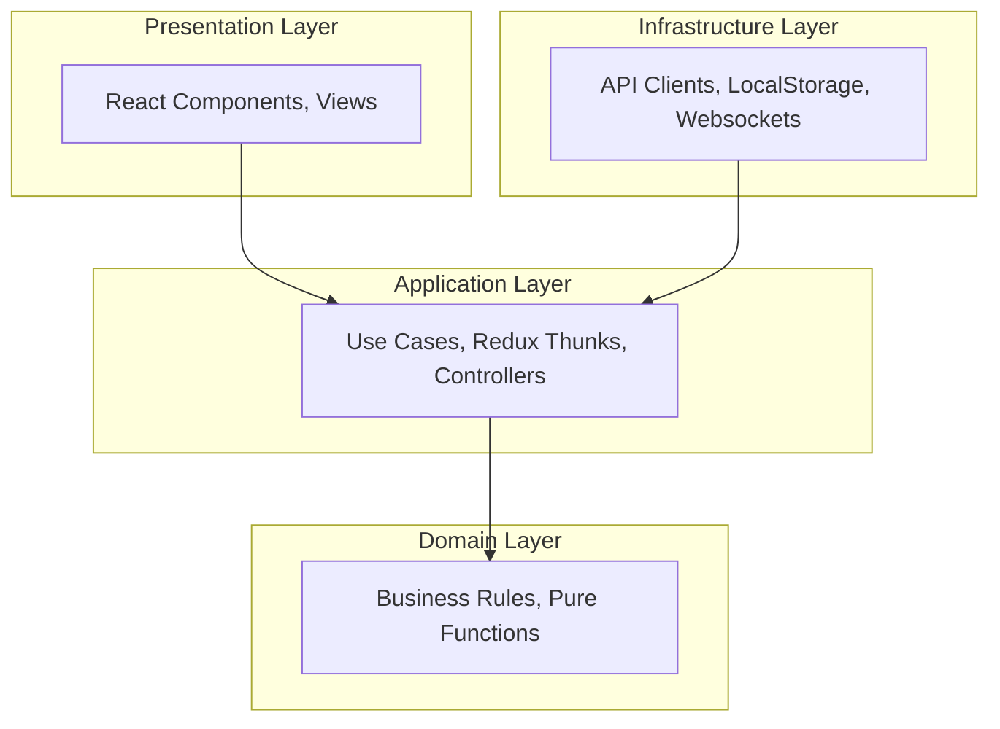

# Декомпозиция по слоям

Декомпозиция по слоям (Layered Architecture, Clean Architecture) — это способ организации кода, при котором приложение делится на "концентрические круги" ответственности. Главное правило: **зависимости всегда направлены только в одну сторону — от внешних слоев к внутренним**.

## Какую боль решаем?

Самая частая проблема фронтенда — это "Божественные компоненты" (God Components). Это когда прямо внутри `useEffect` React-компонента делается `fetch` к API, затем там же парсится сложный JSON с бизнес-правилами, и там же всё это рендерится. 

Такой код невозможно покрыть unit-тестами (нужно мокать DOM и сеть), его невозможно переиспользовать (например, перенести логику из веба в React Native), и любое изменение бэкенда ломает UI.

Декомпозиция по слоям разделяет эту кашу:



## Как это работает на практике

1. **Domain (Домен):** Самое сердце. Чистые функции и интерфейсы. Не знает ни про React, ни про сервер.
2. **Application (Приложение):** Сценарии использования (Use Cases). Оркестрирует данные, например: "Взять данные из API, пропустить через Домен, положить в Стор".
3. **Presentation / Infrastructure (Инфраструктура):** Грязный внешний мир. React, браузерное API, HTTP-запросы.

**Антипаттерн:**
Слой инфраструктуры протекает в домен. Например, доменная модель использует класс `AxiosError` или `HTMLElement`.

**Правильное решение:**
```typescript
// Domain Layer
export interface User { id: string; isAdult: boolean; }
export const checkAccess = (user: User) => user.isAdult;

// Application Layer (Use Case)
export class CheckoutUseCase {
    constructor(private api: IApiService) {} // Зависимость через интерфейс!
    async execute(userId: string) { ... }
}
```

## Неочевидные нюансы и трейдоффы

1. **Огромный оверхед (Boilerplate).** Чтобы просто вывести "Hello, World" с сервера, вам придется создать: DTO, Entity, Mapper, UseCase, Repository Interface, Repository Implementation и View Component. Для простых форм это убивает продуктивность.
2. **Проблема навигации.** Подобно горизонтальной декомпозиции, код фичи размазан по разным слоям. (Именно поэтому современные архитектуры вроде FSD комбинируют вертикальные фичи с горизонтальными слоями внутри).
3. **Где применимо:** Финтех, сложные редакторы, приложения с тяжелой бизнес-логикой на клиенте, которая должна жить годами и пережить смену фреймворков (с React на Solid, например).
