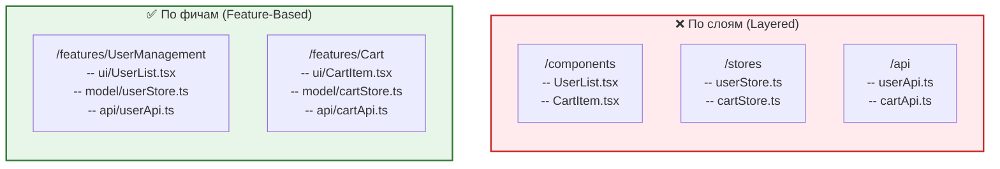

**Декомпозиция по фичам (Feature-based decomposition)** — это подход к организации кодовой базы, при котором папки и модули группируются вокруг бизнес-возможностей (фич), которые они предоставляют пользователю, а не вокруг их технических ролей (компоненты, сервисы, сторы).

Боль, которую мы решаем: в классической "плоской" или "послойной" архитектуре (Layered) разработчику нужно открыть пять разных папок (`actions`, `reducers`, `components`, `containers`, `api`), чтобы собрать воедино или удалить одну фичу (например, "Комментарии"). Код, который изменяется вместе, оказывается размазанным по всему проекту.

## 1. Как это работает на практике

При декомпозиции по фичам вся логика, относящаяся к конкретной функциональности, лежит в одной папке. Фича инкапсулирует в себе свои компоненты, состояние, стили и запросы к API.



Этот подход лежит в основе современных методологий, таких как **Feature-Sliced Design (FSD)**.

### Примеры кода

**❌ Антипаттерн: Группировка по техническому типу**
```text
src/
  ├── components/
  │   ├── AuthForm.tsx
  │   ├── CheckoutButton.tsx
  │   └── ProductCard.tsx
  ├── store/
  │   ├── auth.ts
  │   ├── checkout.ts
  │   └── products.ts
  └── utils/
      └── validatePassword.ts
```
Чтобы понять, как работает авторизация, нужно бегать по всему дереву проекта.

**✅ Как надо: Группировка по фичам**
```text
src/
  ├── features/
  │   ├── auth/
  │   │   ├── ui/AuthForm.tsx
  │   │   ├── model/authStore.ts
  │   │   ├── api/login.ts
  │   │   └── utils/validatePassword.ts // Лежит прямо здесь, так как нужен только тут
  │   │   └── index.ts // Public API фичи
  │   ├── checkout/
  │   │   ├── ...
```
Теперь фича `auth` полностью автономна. Её можно легко удалить, перенести или отрефакторить, не боясь задеть другие части системы.

## 2. Неочевидные нюансы и трейдоффы

* **Проблема "Границ фичи":** Главный минус этого подхода — невероятно сложно определить, что является фичей, а что нет. Например, "Карточка товара с кнопкой в корзину" — это фича `Product` или фича `Cart`? Неправильное определение границ приводит к сильной связанности фич между собой.
* **Связанность фич (Coupling):** Если фича А начинает напрямую зависеть от внутренностей фичи Б (например, Корзина импортирует интерфейсы из Каталога), архитектура быстро деградирует в тот же спагетти-код, только на уровне папок. Для решения этого необходимо вводить строгие правила взаимодействия через **Public API** (`index.ts`) и запрет кросс-импортов между фичами.
* **Переиспользование логики:** Если какая-то утилита из фичи (например, `validatePassword`) понадобилась на другом экране, разработчику придется рефакторить код, извлекая её из фичи `auth` вниз, в `Shared Kernel`. 
* **Где применимо:** Почти везде. Это стандарт де-факто для современных SPA на React, Vue или Angular средних и крупных размеров. Улучшает онбординг (новый разработчик сразу видит бизнес-возможности проекта по названиям папок).
* **Где ломается:** В сверхмалых проектах (лендинги) создание папок под фичи ради двух компонентов — это чистый оверхед. Также ломается при отсутствии архитектурной дисциплины: если разработчики начинают писать кросс-зависимости между фичами бездумно.
