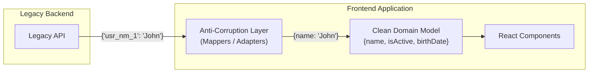

# Anti-Corruption Layer (Слой предохранения от порчи)

Anti-Corruption Layer (ACL) — это архитектурный паттерн, пришедший из Domain-Driven Design (DDD). Его суть — создание "буферной зоны" или фасада между двумя подсистемами, чтобы модель данных одной системы не "заразила" (не испортила) модель данных другой системы.

## Какую боль решаем?

Представьте, что вы пишете чистый, красивый фронтенд. И тут вам нужно интегрироваться с Legacy-бэкендом 2005 года. 
Бэкенд присылает данные о пользователе в таком виде: `{"usr_nm_1": "John", "flg_actv": 1, "dt_brth": "1990-12-01"}`.

Если вы начнете использовать эту структуру напрямую в ваших React-компонентах и стейт-менеджере:
1. Вы "заразите" свой код уродливым неймингом.
2. Когда бэкенд наконец-то перепишут, вам придется переписывать весь фронтенд, потому что `usr_nm_1` расползлось по сотням файлов.

ACL ставит жесткую границу.



## Как это работает на практике

ACL во фронтенде обычно реализуется через Data Transfer Objects (DTO) и функции-мапперы. Запрос к API сразу же проходит через маппер, который превращает "грязные" данные сервера в "чистые" доменные сущности клиента.

**Антипаттерн:**
```tsx
// Компонент напрямую зависит от контракта сервера
const UserCard = ({ data }) => {
  return (
    <div>
       <h1>{data.usr_nm_1}</h1>
       {data.flg_actv === 1 && <span>Active</span>}
    </div>
  )
}
```

**Правильное решение:**
```typescript
// 1. Описываем DTO (как присылает сервер)
interface UserDTO { usr_nm_1: string; flg_actv: number; }

// 2. Описываем Доменную модель (как удобно нам)
interface User { name: string; isActive: boolean; }

// 3. ACL Mapper
const mapUserDtoToDomain = (dto: UserDTO): User => ({
    name: dto.usr_nm_1,
    isActive: dto.flg_actv === 1
});

// 4. Компонент чист и ничего не знает про сервер
const UserCard = ({ user }: { user: User }) => <h1>{user.name}</h1>;
```

## Неочевидные нюансы и трейдоффы

1. **Оверхед на разработку.** На каждый чих вам придется писать интерфейс DTO, интерфейс Модели и функцию-маппер. Это замедляет разработку.
2. **Потеря производительности.** Маппинг массивов из 10 000 элементов на фронтенде может вызвать проблемы с производительностью (особенно если внутри маппера есть сложные трансформации дат или вложенных объектов).
3. **Где применимо:** Интеграция со сторонними (3rd party) API, легаси-системами, или когда фронтенд и бэкенд разрабатываются независимыми командами с разными темпами.
4. **Когда НЕ нужно:** Если вы пишете Fullstack-приложение (например, на Next.js или tRPC), где клиент и сервер используют общую кодовую базу и контракты генерируются автоматически (End-to-End Type Safety). В таком случае ACL — это бессмысленное дублирование.
