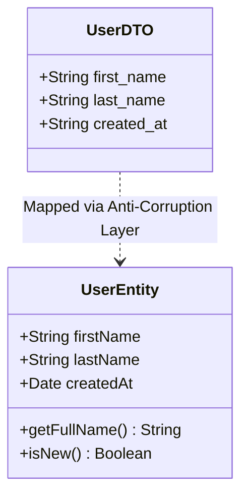

# DTO (Data Transfer Object)

DTO (Data Transfer Object) — это объект, единственная цель которого — переносить сырые данные между различными процессами, подсистемами или слоями приложения. DTO **не содержит никакого поведения** (методов, валидаций, бизнес-логики).

## Какую боль решаем?

При общении фронтенда с бэкендом (или между изолированными модулями) передача полноценных бизнес-сущностей (Entities) невозможна или опасна.

1. **Невозможность сериализации.** Бизнес-модель может содержать методы (например, `user.getFullName()`) или циклические ссылки. Вы не можете передать это по сети через JSON.
2. **Утечка деталей реализации.** Бэкенд может хранить пароли в сущности `User`, но на фронтенд эти данные передавать нельзя.
3. **Разница в форматах.** Сервер отдает даты в ISO-строках (`"2023-10-01T12:00:00Z"`), а фронтенд хочет работать с объектами `Date` или `moment/dayjs`.

DTO служит "глупым" контейнером, который описывает строго то, что летает по проводам.



## Как это работает на практике

Во фронтенде DTO чаще всего существует в виде TypeScript-интерфейсов, описывающих контракты API.

**Антипаттерн:**
Использование одного интерфейса и для сети, и для UI.
```typescript
// Описание того, что пришло с сервера
interface Product {
  id: string;
  price_cents: number;
  created_at: string; // Строка!
}

// Попытка добавить метод ломает интерфейс, так как с сервера методы не приходят
```

**Правильное решение:**
Четкое разделение DTO и бизнес-модели.
```typescript
// 1. DTO - контракт сети
export interface CreateUserRequestDTO {
  email: string;
  phone_number: string;
}

export interface UserResponseDTO {
  id: string;
  created_at: string;
}

// 2. Трансформация DTO в модель происходит на границе (в API слое)
async function fetchUser(): Promise<UserEntity> {
   const dto: UserResponseDTO = await api.get('/user');
   return {
       id: dto.id,
       createdAt: new Date(dto.created_at) // Превратили DTO в доменную сущность
   };
}
```

## Неочевидные нюансы и трейдоффы

1. **Дублирование кода.** Если ваш бэкенд и фронтенд хорошо синхронизированы, DTO часто является 100% копией вашей клиентской модели. Писать интерфейс дважды (один для DTO, другой для Model) кажется нарушением DRY.
2. **Генерация контрактов.** Писать DTO руками — прошлый век. В современных проектах DTO генерируются автоматически из Swagger/OpenAPI спецификации, GraphQL схемы или tRPC контрактов. Фронтендеру остается только написать маппер (если он нужен).
3. **Где применимо:** На границах приложения (API клиенты) и на жестких границах между независимыми модулями в микрофронтендах.
