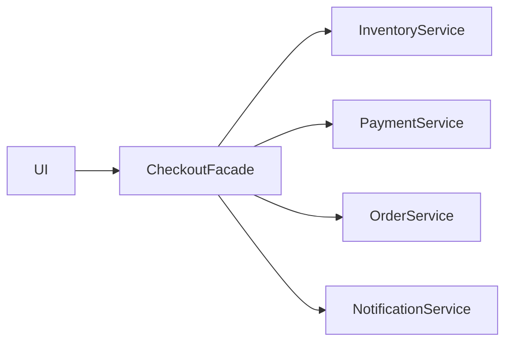

## Facade — Фасад

**Facade** предоставляет простой интерфейс к сложной подсистеме.

Например, чтобы оформить заказ, нужно:

1. проверить остатки;
2. зарезервировать товары;
3. списать деньги;
4. создать заказ;
5. отправить уведомление.

Без фасада UI должен был бы знать обо всех этих сервисах.

### Сервисы подсистемы

```ts
class InventoryService {
  async reserve(productId: string, quantity: number) {
    console.log(`Reserved ${quantity} units of ${productId}`);
  }
}

class PaymentService {
  async charge(userId: string, amount: number) {
    console.log(`Charged ${amount} from user ${userId}`);
  }
}

class OrderService {
  async create(userId: string, productId: string, quantity: number) {
    console.log(`Order created for ${userId}`);
    return { id: "order-123" };
  }
}

class NotificationService {
  async sendOrderConfirmation(userId: string, orderId: string) {
    console.log(`Confirmation sent to ${userId} for ${orderId}`);
  }
}
```

### Фасад

```ts
class CheckoutFacade {
  constructor(
    private inventory = new InventoryService(),
    private payment = new PaymentService(),
    private orders = new OrderService(),
    private notifications = new NotificationService()
  ) {}

  async checkout(params: {
    userId: string;
    productId: string;
    quantity: number;
    amount: number;
  }) {
    await this.inventory.reserve(params.productId, params.quantity);
    await this.payment.charge(params.userId, params.amount);

    const order = await this.orders.create(
      params.userId,
      params.productId,
      params.quantity
    );

    await this.notifications.sendOrderConfirmation(params.userId, order.id);

    return order;
  }
}
```

Использование в UI:

```ts
const checkout = new CheckoutFacade();

await checkout.checkout({
  userId: "user-1",
  productId: "keyboard-1",
  quantity: 1,
  amount: 150,
});
```



---