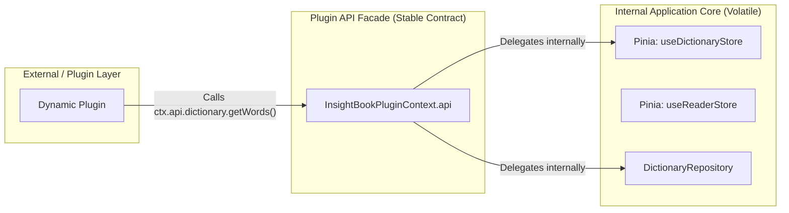

# Facade (Фасад) и Plugin API Facade Pattern

Паттерн **Facade (Фасад)** предоставляет унифицированный и упрощенный интерфейс к сложной подсистеме состояний, сервисов и бизнес-логики. В архитектуре frontend-приложений фасад выполняет роли:
1. Упрощения вызова связанных операций UI-слоем.
2. **Изоляционной границы (API Facade Pattern)** между ядром приложения (Pinia stores, Repositories, HTTP client) и сторонними расширениями или динамическими плагинами.



## 1. Классический вариант: Фасад над сложной подсистемой

Когда для выполнения бизнес-операции (например, оформления заказа) требуется скоординировать работы нескольких подсистем, UI не должен знать о деталях реализации каждого сервиса.

### Код подсистем и фасада

```ts
class InventoryService {
  async reserve(productId: string, quantity: number) {
    console.log(`Reserved ${quantity} units of ${productId}`);
  }
}

class PaymentService {
  async charge(userId: string, amount: number) {
    console.log(`Charged ${amount} from user ${userId}`);
  }
}

class OrderService {
  async create(userId: string, productId: string, quantity: number) {
    return { id: "order-123" };
  }
}

// Фасад, объединяющий подсистему в один простой метод
export class CheckoutFacade {
  constructor(
    private inventory = new InventoryService(),
    private payment = new PaymentService(),
    private orders = new OrderService()
  ) {}

  async checkout(params: { userId: string; productId: string; quantity: number; amount: number }) {
    await this.inventory.reserve(params.productId, params.quantity);
    await this.payment.charge(params.userId, params.amount);
    return await this.orders.create(params.userId, params.productId, params.quantity);
  }
}
```

---

## 2. Специализированный вариант: Plugin API Facade Pattern

При поддержке **динамических плагинов** предоставление стороннему коду прямого доступа к внутренним Pinia-сторам (`useDictionaryStore()`) — это катастрофический антипаттерн. 

Если вы поменяете имя переменной в Pinia-сторе или перейдете с Pinia на Effector/Signals, сотни сторонних плагинов сломаются.

### Антипаттерн: Прямой проброс Pinia-стора плагинам

```typescript
// Антипаттерн: Плагин напрямую работает с Pinia store хоста
export default definePlugin({
  setup(ctx) {
    // Если вы переименуете 'words' в 'dictionaryItems', плагин упадет в рантайме
    const dictStore = useDictionaryStore(); 
    console.log(dictStore.words);
  }
});
```

### Как надо: Стабильный фасад контекста плагина

Создается абстрактная стабильная прослойка (`InsightBookPluginContext`), которая передается плагину при инициализации. Внутри метода фасада может быть обращение к Pinia, но сам плагин видит только неизменяемый TS-контракт.

```typescript
// packages/plugin-api/src/index.ts
export interface InsightBookPluginContext {
  notify: (message: string, type?: 'info' | 'error') => void;
  api: {
    dictionary: {
      getWords: () => Promise<UserDictItem[]>;
      submitGrade: (wordId: number, grade: number) => Promise<void>;
    };
    reader: {
      getCurrentBook: () => Book | null;
    };
  };
}

// Host App: plugin-manager.ts
export function createPluginContext(): InsightBookPluginContext {
  return {
    notify: (msg, type) => useNotificationStore().add(msg, type),
    api: {
      dictionary: {
        getWords: async () => {
          // Стабильная обертка: внутри мы можем рефакторить Pinia как угодно
          const store = useDictionaryStore();
          return store.words.map(mapToPublicApiFormat);
        },
        submitGrade: async (wordId, grade) => {
          const repo = useDictionaryRepository();
          await repo.saveReview(wordId, grade);
        }
      },
      reader: {
        getCurrentBook: () => useReaderStore().currentBook,
      }
    }
  };
}
```

## Неочевидные нюансы и границы применимости

1. **Защита от мутаций state:** Фасад обязан возвращать клиентам/плагинам глубокие копии объектов (`structuredClone`) или read-only прокси, чтобы сторонний плагин случайно не мутировал внутренний state Pinia в обход action-методов.
2. **Версионирование контракта:** При добавлении новых функций в фасад старые методы сохраняются с пометкой `@deprecated` для поддержки обратной совместимости плагинов.
3. **Оверхед на трансляцию типов:** Использование фасада создает дополнительную прослойку вызовов и требует конвертации внутренне используемых сущностей (Domain Models) во внешние DTO. В некрупных монолитных приложениях без плагинов выстраивание фасада над каждым стором приведет к написанию большого количества бойлерплейта.