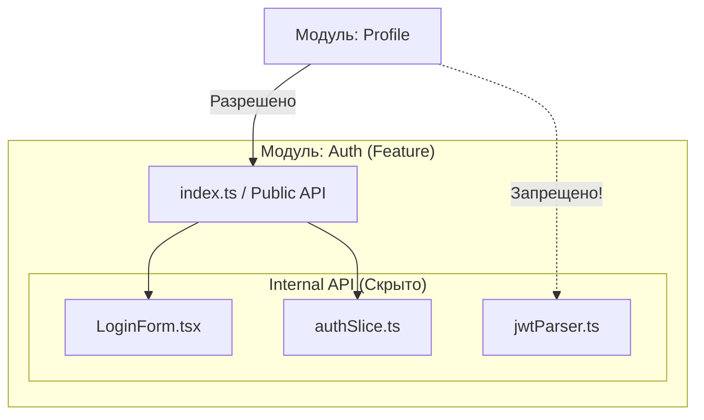

# Internal API модуля

Internal API (Внутреннее API) — это всё то внутри модуля, что скрыто от остальной части приложения. Это "приватные" компоненты, вспомогательные функции, локальный стейт и интерфейсы, которые нужны модулю для работы, но не предназначены для экспорта наружу.

## Какую боль решаем?

Главный бич больших монолитов — **сильная связанность (High Coupling) через внутренности**. 
Представьте модуль "Авторизация". Внутри него есть утилита `parseJwtToken`. Разработчик из модуля "Профиль", которому понадобилось распарсить токен, недолго думая пишет:
`import { parseJwtToken } from '../../auth/src/utils/parsers/jwt'`.

Что происходит дальше?
1. Модуль "Профиль" теперь жестко зависит от внутренней структуры папок модуля "Авторизация".
2. Разработчик модуля "Авторизация" решает провести рефакторинг: переименовать `parsers` в `helpers`.
3. Сборка падает, потому что ломается импорт в совершенно другом модуле, о котором автор "Авторизации" даже не знал.

Разделение на Public API (то, что можно импортировать) и Internal API (то, что нельзя) делает рефакторинг безопасным.



## Как это работает на практике

Самый популярный способ защитить Internal API во фронтенде — это использование паттерна **Barrel Exports (index.ts)** и настройка линтеров.

Файл `index.ts` в корне модуля выступает "фасадом". Всё, что в нём экспортируется — это Public API. Всё остальное — Internal API.

**Антипаттерн (Deep Imports):**
Глубокие импорты в обход фасада нарушают инкапсуляцию.
```tsx
// Плохо: лезем во внутренности чужого модуля
import { LoginForm } from 'features/auth/ui/LoginForm';
import { selectToken } from 'features/auth/store/selectors';
```

**Правильное решение:**
```typescript
// features/auth/index.ts (Определяем Public API)
export { AuthWidget } from './ui/AuthWidget'; // LoginForm осталась приватной!
export { useAuthUser } from './hooks/useAuthUser';
```

```tsx
// features/profile/ui/Profile.tsx
// Хорошо: импортируем только то, что разрешил модуль Auth
import { AuthWidget, useAuthUser } from 'features/auth';
```

## Неочевидные нюансы и трейдоффы

1. **Как контролировать?** В JavaScript/TypeScript нет модификаторов `private` для файлов. Защита Internal API работает только на честном слове или через статический анализ. Чтобы физически запретить глубокие импорты, необходимо настраивать `eslint-plugin-boundaries` или `eslint-plugin-import` (правило `no-restricted-imports`).
2. **Разрастание Barrel-файлов.** Если модуль слишком большой, его `index.ts` может стать свалкой. Если вы экспортируете 90% содержимого модуля наружу — это признак того, что границы модуля выбраны неверно (Low Cohesion).
3. **Циклические зависимости.** Если Internal API одного модуля зависит от Public API другого, а тот в свою очередь ссылается обратно — сборщики (Webpack/Vite) могут падать с ошибками "cannot access before initialization".
