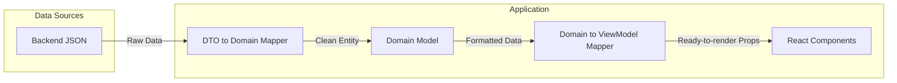

# Mapping между моделями

Mapping (маппинг) — это процесс преобразования данных из одного формата в другой. Во фронтенде маппинг чаще всего происходит на двух границах: между сервером (DTO) и бизнес-логикой (Domain), а также между бизнес-логикой и UI (ViewModel).

## Какую боль решаем?

Представьте, что с сервера приходит объект:
`{ "user_fn": "Ivan", "user_ln": "Ivanov", "b_date": 1690000000, "roles": ["admin", "manager"] }`

Если передать этот объект прямо в React-компонент, возникнет боль:
1. В JSX придется писать: `<h1>{data.user_fn} {data.user_ln}</h1>` — это утечка серверного нейминга в UI.
2. Дату придется форматировать прямо внутри рендера: `<span>{new Date(data.b_date).toLocaleDateString()}</span>`. 
3. Если бэкенд изменит поле `user_fn` на `firstName`, вам придется искать и править это по всем компонентам.

Маппинг изолирует эти изменения. Компонент должен получать уже готовую "пищу", которую удобно "жевать".



## Как это работает на практике

Маппер — это всегда чистая функция (Pure Function), которая принимает объект одного типа и возвращает объект другого.

**Антипаттерн:**
Маппинг внутри компонента:
```tsx
const UserProfile = ({ dto }) => {
  const fullName = `${dto.user_fn} ${dto.user_ln}`; // Логика склейки в UI
  const isAdmin = dto.roles.includes('admin'); // Бизнес-логика в UI
  return <div>{fullName} {isAdmin && '⭐️'}</div>;
}
```

**Правильное решение:**
```typescript
// 1. Описываем идеальную модель для UI (ViewModel)
interface UserVM {
  fullName: string;
  isAdmin: boolean;
  formattedBirthDate: string;
}

// 2. Пишем чистую функцию-маппер
const mapDtoToUserVM = (dto: UserDTO): UserVM => ({
  fullName: `${dto.user_fn} ${dto.user_ln}`,
  isAdmin: dto.roles.includes('admin'),
  formattedBirthDate: dayjs(dto.b_date).format('DD.MM.YYYY')
});

// 3. Компонент максимально туп и декларативен
const UserProfile = ({ user }: { user: UserVM }) => (
  <div>{user.fullName} {user.isAdmin && '⭐️'}</div>
);
```

## Неочевидные нюансы и трейдоффы

1. **Оверхед по производительности.** Если вам нужно отрендерить таблицу на 10 000 строк, прогонять каждый элемент через сложный маппер (особенно с форматированием дат или глубоким клонированием) может быть дорого для Main Thread браузера.
2. **Когда маппить?** Существует два подхода. Первый — маппить данные сразу на уровне API-клиента (чтобы в стор ложились уже чистые доменные модели). Второй — хранить в сторе сырые DTO, а маппить их в селекторах (Reselect) прямо перед отдачей в UI. Второй подход лучше, если данные часто обновляются частично (patch).
3. **Где ломается:** В микро-проектах или при использовании GraphQL. GraphQL позволяет сразу запросить данные в нужном формате, что делает клиентский маппинг практически ненужным.
