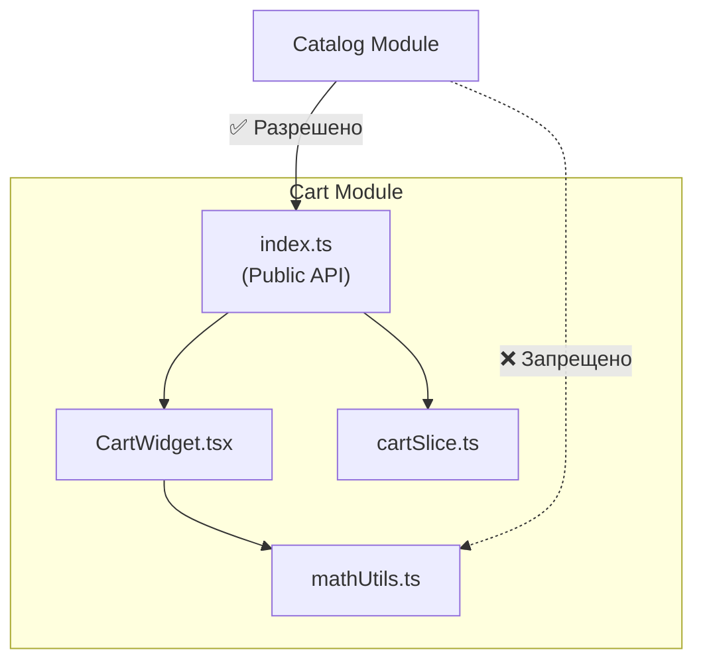

# Public API модуля

Public API модуля — это его фасад, "витрина" или "контракт". Это строго определенный список сущностей (компонентов, функций, хуков, типов), которые создатель модуля разрешает использовать остальным частям приложения. Всё, что не вошло в Public API, считается приватной деталью реализации.

## Какую боль решаем?

Самая частая причина "хрупкости" больших приложений — это глубокие импорты (Deep Imports).

Представьте, вы пишете модуль "Корзина". Внутри вы создали полезную функцию `calculateDiscount()`. Разработчик из модуля "Каталог" нашел эту функцию и импортировал её напрямую: 
`import { calculateDiscount } from '../../cart/src/utils/math/calculateDiscount'`.

Через месяц вы решаете отрефакторить "Корзину" и удаляете папку `math`. Внезапно, сборка падает, потому что вы сломали "Каталог". Вы не могли этого предвидеть, потому что разработчик "Каталога" залез "под капот" вашего модуля без спроса.

Public API создает жесткую границу, которая гарантирует безопасность рефакторинга.



## Как это работает на практике

Технически Public API во фронтенде реализуется через **Barrel-файлы** — это файлы `index.ts`, которые лежат в корне модуля и реэкспортируют только то, что нужно.

**Антипаттерн:**
Импорт в обход Public API.
```typescript
// features/catalog/ui/Product.tsx
import { CartButton } from 'features/cart/ui/components/buttons/CartButton';
import type { CartState } from 'features/cart/model/types';
```

**Правильное решение:**
Модуль сам решает, что отдать наружу через свой `index.ts`.
```typescript
// features/cart/index.ts (Это и есть Public API)
export { CartButton } from './ui/CartButton';
export type { CartType } from './model/types';
// Заметьте, мы НЕ экспортируем внутренние утилиты или reducer!
```

Потребление:
```typescript
// features/catalog/ui/Product.tsx
// Импортируем только из корня модуля
import { CartButton, type CartType } from 'features/cart';
```

## Неочевидные нюансы и трейдоффы

1. **Защита контракта.** JavaScript не запрещает глубокие импорты. Наличие `index.ts` само по себе ничего не гарантирует. Чтобы сделать Public API обязательным, необходимо настроить линтеры (например, `eslint-plugin-boundaries` в FSD или `nx enforce-module-boundaries`), которые будут физически "бить по рукам" за импорты в обход `index.ts`.
2. **Проблема раздувания фасада.** Если ваш модуль экспортирует 50 компонентов и 20 функций — это плохой модуль (Low Cohesion). Фасад должен быть минимальным. Идеальный модуль экспортирует 1-2 главных компонента (виджета) и пару типов.
3. **Разрешение циклических зависимостей.** Слишком много логики в одном `index.ts` часто приводит к циклическим импортам внутри самого модуля, когда файл А импортирует из `index.ts`, который импортирует файл Б, который ссылается на файл А. Избегайте использования Public API *внутри* самого модуля!
