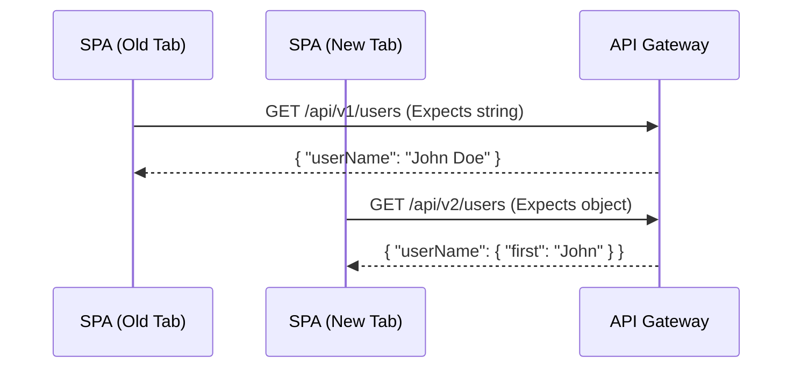

# Версионирование контрактов

Версионирование контрактов — это практика явного указания и поддержки версий форматов данных или интерфейсов взаимодействия между различными системами (например, между Frontend и Backend, или между разными Microfrontends).

## Какую боль решаем?

Главный кошмар распределенных систем — **Breaking Changes (ломающие изменения)**.

Бэкендер решает, что поле `userName` в JSON-ответе теперь должно быть объектом `{ first: "John", last: "Doe" }`, и выкатывает это на продакшен. Фронтенд, который ожидал строку, падает с белым экраном у тысяч пользователей.

Даже если релизы синхронизированы, есть пользователи, у которых открыта "старая" вкладка браузера (или закеширован старый JS-бандл), и они делают запросы к "новому" бэкенду. 

Версионирование позволяет системам развиваться асинхронно. Бэкенд выкатывает v2, но продолжает поддерживать v1, пока все фронтенд-клиенты не обновятся.



## Как это работает на практике

### 1. Версионирование на уровне API (Frontend <-> Backend)

Чаще всего версии указываются в URL или заголовках.
- **URL Versioning:** `fetch('https://api.myapp.com/v1/profile')`
- **Header Versioning:** `fetch('...', { headers: { 'Accept-Version': 'v2.0' } })`

Когда появляется версия `v2`, фронтенд-разработчики создают новый DTO и новый маппер (Anti-Corruption Layer), параллельно удаляя старый код (или оставляя его временно для A/B тестов).

### 2. Версионирование на уровне Микрофронтендов (Frontend <-> Frontend)

Если Команда А (Header) предоставляет компонент Команде Б (App Shell) через Module Federation, изменение `props` компонента Header сломает App Shell.
Здесь используется версионирование npm-пакетов (SemVer).

**Антипаттерн:**
Завязываться на `latest` версию контракта.
```json
// package.json микрофронтенда
"dependencies": {
  "@company/shared-header": "latest"
}
```

**Правильное решение:**
Строгое фиксирование мажорных версий.
```json
"dependencies": {
  "@company/shared-header": "^2.1.0" // Принимаем патчи и миноры, но не v3.0!
}
```

## Неочевидные нюансы и трейдоффы

1. **Накопление технического долга.** Версионирование — это дорого. Бэкенду (или авторам шареных UI-модулей) приходится поддерживать старый код (`v1`, `v2`, `v3`) годами, потому что где-то еще могут быть живы старые мобильные клиенты или закешированные страницы.
2. **Sunsetting (Вывод из эксплуатации).** Версионирование бессмысленно без процесса "убийства" старых версий. Должны быть настроены алерты: "когда трафик на v1 падает ниже 1%, мы удаляем этот код".
3. **Где не нужно:** В небольших монолитных fullstack-приложениях (например, Next.js / Nuxt / tRPC), где фронтенд и бэкенд деплоятся одновременно и жестко связаны типами. Там проще сделать "мягкую миграцию" (добавить новое поле, перевести UI на него, удалить старое поле) без мажорного версионирования.
