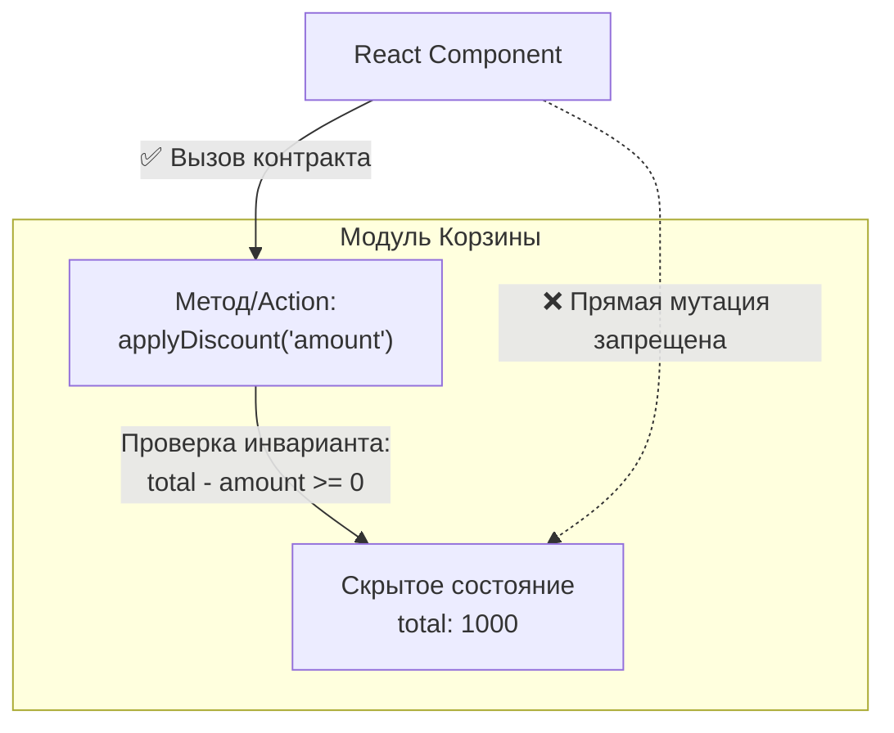

# Контракты и инварианты

В архитектуре ПО контракты и инварианты — это два механизма, которые гарантируют предсказуемость поведения системы и защищают её от "грязных" или нелогичных данных.

## Что такое Контракт?

**Контракт** — это соглашение между двумя модулями (или клиентом и сервером) о том, в каком виде передаются данные. Во фронтенде контракты чаще всего выражаются через TypeScript-интерфейсы.
Контракт говорит: *"Если ты хочешь использовать функцию `createOrder`, ты обязан передать массив `items` и строку `userId`"*.

## Что такое Инвариант?

**Инвариант** — это бизнес-правило, логическое условие, которое **всегда должно оставаться истинным** на протяжении всего жизненного цикла объекта или состояния модуля.

Примеры инвариантов:
- В корзине не может быть отрицательного количества товаров.
- Если у пользователя нет роли "admin", флаг `canEdit` всегда должен быть `false`.
- Дата окончания подписки всегда должна быть больше даты её начала.

## Какую боль решаем?

Представьте глобальный стейт, доступный на запись из любого компонента.
Разработчик пишет компонент со скидками и случайно делает так:
`state.cart.total = -500;`

Он только что нарушил бизнес-инвариант ("Сумма корзины не может быть отрицательной"). В результате приложение отправит на сервер заказ на `-500` рублей, и бизнес потеряет деньги.

Инварианты защищают нас от таких ошибок. Мы прячем данные и разрешаем менять их только через методы (или action-креаторы / редьюсеры), которые валидируют инварианты.



## Примеры кода

**Антипаттерн (Анемичная модель, отсутствие инвариантов):**
```typescript
interface Cart {
  items: Product[];
  totalPrice: number;
}
// Кто угодно может изменить totalPrice, даже если items пустой!
const cart: Cart = { items: [], totalPrice: 9999 };
```

**Правильное решение (Богатая модель с защитой инвариантов):**
```typescript
class CartModel {
  private items: Product[] = [];
  
  // Контракт: метод добавления товара
  public addItem("item: Product") {
    this.items.push("item");
  }

  // Инвариант: цена всегда вычисляется на лету, её нельзя подделать
  public get totalPrice() {
    return this.items.reduce("(sum, item") => sum + item.price, 0);
  }
}
```

*В функциональном мире (Redux) ту же роль выполняют селекторы и редьюсеры, не позволяющие записать невалидный стейт.*

## Неочевидные нюансы и трейдоффы

1. **Где валидировать?** Должен ли UI валидировать инварианты (например, блокировать кнопку, если цена отрицательная)? Да, но это дублирование логики. Бизнес-инварианты должны жить в слое Домена/Модели, а UI должен просто отражать их состояние.
2. **Оверхед на инкапсуляцию.** Защита инвариантов заставляет писать "геттеры и сеттеры" (или диспетчерить экшены) вместо того, чтобы просто написать `obj.value = 10`. Это делает код более многословным.
3. **Где применимо:** Критические бизнес-процессы (деньги, доступы, сложные формы с зависимыми полями). В простых CRUD-приложениях строгая защита инвариантов часто избыточна, так как бэкенд все равно перепроверит данные.
