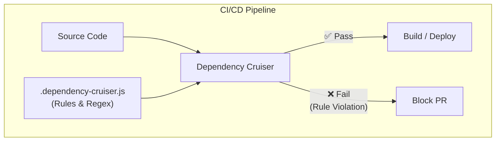

# Dependency Cruiser

Dependency Cruiser — это мощный инструмент командной строки (CLI) для статического анализа, визуализации и, что самое главное, **валидации графа зависимостей** в проектах на JavaScript, TypeScript и других JS-подобных языках.

## Какую боль решаем?

Мы все знаем правило: "UI-компоненты (слой Presentation) не должны зависеть от API-клиентов напрямую". Или правило Feature-Sliced Design (FSD): "Модули слоя Features могут импортировать модули из Shared и Entities, но не наоборот".

Проблема в том, что эти правила обычно живут в Markdown-файлах `ARCHITECTURE.md`, которые никто не читает. Рано или поздно уставший разработчик пишет:
`import { userStore } from '../../../features/auth/store'` прямо внутри базовой кнопки в `shared`.

Код-ревьюер этого не замечает, и архитектура начинает гнить. Возникают циклические зависимости и "спагетти-код". Dependency Cruiser превращает бумажные правила в **автоматизированные тесты**, которые валят сборку (CI/CD) при нарушении архитектуры.



## Как это работает на практике

Инструмент конфигурируется через файл `.dependency-cruiser.js`, где вы описываете правила с помощью регулярных выражений или глобов.

**Пример правила: Запрет импортов из `features` в `shared`**
```javascript
module.exports = {
  forbidden: [
    {
      name: 'no-features-in-shared',
      comment: 'Shared layer must not depend on features',
      severity: 'error',
      from: {
        path: '^src/shared' // Если файл находится в shared...
      },
      to: {
        path: '^src/features' // ...ему запрещено импортировать из features!
      }
    },
    {
      name: 'no-circular-dependencies',
      severity: 'error',
      from: {},
      to: {
        circular: true // Встроенная защита от циклических зависимостей
      }
    }
  ]
};
```

## Неочевидные нюансы и трейдоффы

1. **Крутая кривая обучения.** Написание правил на регулярных выражениях для сложных архитектур (вроде FSD) может быть очень болезненным. Конфиг быстро разрастается до сотен строк.
2. **Скорость работы.** На огромных монорепозиториях (сотни тысяч строк кода) полный прогон Dependency Cruiser может занимать ощутимое время, поэтому его стоит оптимизировать (анализировать только измененные файлы).
3. **Визуализация.** Это крутая, но недооцененная фича. Инструмент умеет генерировать SVG/HTML-графы вашего проекта. Посмотреть на "клубок ниток", в который превратился ваш код — отличная мотивация для рефакторинга.
4. **Альтернативы:** Если вы используете React и ESLint, иногда проще обойтись плагином `eslint-plugin-boundaries`. Dependency Cruiser мощнее, но ESLint привычнее для фронтендеров и работает прямо в IDE из коробки.
