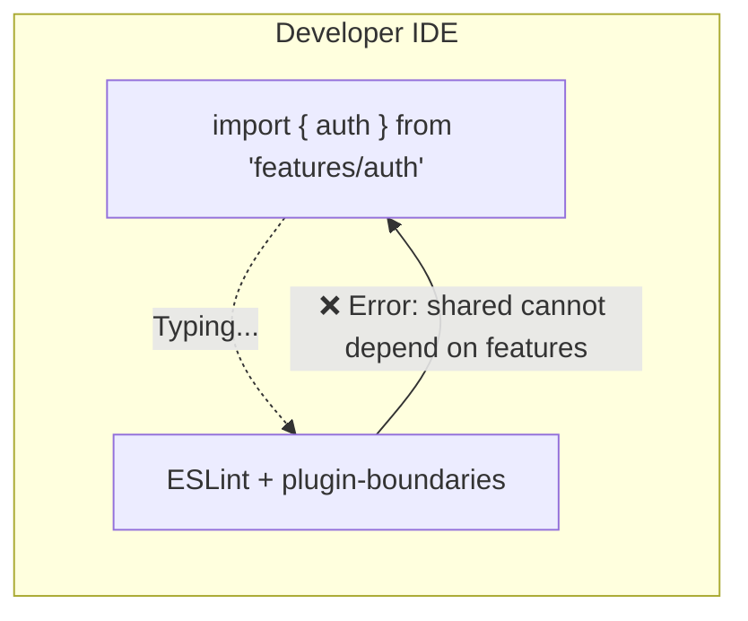

# ESLint Boundaries

ESLint Boundaries (`eslint-plugin-boundaries`) — это плагин для популярного линтера ESLint, который позволяет разработчикам контролировать пути импортов в проекте на основе архитектурных правил. Он следит за тем, чтобы модули общались друг с другом только так, как было задумано архитектурой.

## Какую боль решаем?

Архитектура существует только тогда, когда за её соблюдением кто-то (или что-то) следит. Если в проекте 20 разработчиков, неизбежно кто-то сделает импорт, который нарушает слои: например, утилита из слоя `shared` импортирует бизнес-логику из `features`. 

Без автоматизированного контроля такие ошибки:
1. Пропускаются на Code Review.
2. Приводят к циклическим зависимостям (Circular Dependencies).
3. Превращают модульную систему в "Большой Комок Грязи" (Big Ball of Mud).

В отличие от тяжеловесных инструментов вроде Dependency Cruiser, ESLint Boundaries работает **прямо в редакторе кода (IDE)**. Разработчик видит красное подчеркивание сразу же, как только написал неправильный `import`, а не на этапе CI/CD.



## Как это работает на практике

Де-факто, этот плагин стал стандартом для контроля архитектуры **Feature-Sliced Design (FSD)**, так как идеально подходит для валидации её жестких правил (направление зависимостей только вниз: `app -> pages -> widgets -> features -> entities -> shared`).

**Пример конфигурации (`.eslintrc.js`):**

```javascript
module.exports = {
  plugins: ['boundaries'],
  settings: {
    'boundaries/elements': [
      { type: 'shared', pattern: 'src/shared/*' },
      { type: 'features', pattern: 'src/features/*' },
      { type: 'app', pattern: 'src/app/*' }
    ]
  },
  rules: {
    'boundaries/element-types': [
      2, // Error
      {
        default: 'disallow',
        rules: [
          // Приложение может импортировать фичи и шареное
          { from: 'app', allow: ['features', 'shared'] },
          // Фичи могут импортировать только шареное
          { from: 'features', allow: ['shared'] },
          // Shared не может импортировать НИЧЕГО (кроме других shared)
          { from: 'shared', allow: ['shared'] } 
        ]
      }
    ]
  }
};
```

**Пример ошибки в коде:**
```tsx
// Файл: src/shared/ui/Button.tsx
import { loginUser } from 'features/auth'; 
// ^^^ ESLint подсветит это красным: "Dependency is not allowed"
```

## Неочевидные нюансы и трейдоффы

1. **Отключение правил (eslint-disable).** Самая большая уязвимость линтеров в том, что разработчики могут написать `// eslint-disable-next-line boundaries/element-types` и проигнорировать архитектуру. Если в проекте много таких комментариев — это симптом того, что архитектура спроектирована неверно (она мешает бизнесу, а не помогает).
2. **Сложность настройки.** Конфигурирование плагина для сложных, нестандартных архитектур может быть болезненным. Нужно хорошо знать синтаксис `micromatch` (глобы).
3. **Где ломается:** Плагин плохо работает с монорепозиториями (где много `package.json` и алиасов путей) из коробки. Для монореп лучше использовать инструменты от их создателей (например, `@nx/enforce-module-boundaries`).
