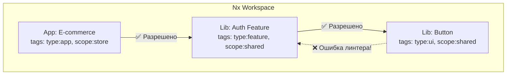

# Nx Module Boundaries

Nx Module Boundaries (`@nx/enforce-module-boundaries`) — это встроенный в экосистему монорепозиториев Nx инструмент статического анализа. Он позволяет архитекторам задавать строгие правила о том, какие проекты (библиотеки или приложения) внутри монорепозитория имеют право импортировать друг друга.

## Какую боль решаем?

В монорепозитории может быть 100+ библиотек. Например: `shared-ui`, `auth-feature`, `checkout-api`, `admin-app`.
Когда весь код лежит в одном месте, соблазн импортировать "соседнюю" библиотеку огромен. 

Возникают проблемы:
1. **Нарушение доменных границ:** Приложение `admin-app` случайно импортирует библиотеку, предназначенную только для `client-app`.
2. **Нарушение слоев:** UI-библиотека начинает импортировать библиотеку работы с базой данных (или API).
3. **Циклические зависимости:** Библиотека A зависит от Б, Б зависит от В, В зависит от А. При сборке (build) Nx не может понять, в каком порядке их собирать, и всё падает.

Nx решает эту проблему через систему **тегов (Tags)** и линтинг.



## Как это работает на практике

1. Вы присваиваете теги каждому проекту в его файле `project.json` (или `nx.json`).
Обычно используют два измерения: тип (слой) и область применения (домен).
```json
// libs/shared/ui/project.json
{ "tags": ["type:ui", "scope:shared"] }

// libs/auth/feature/project.json
{ "tags": ["type:feature", "scope:auth"] }
```

2. В корневом конфигурационном файле линтера (`.eslintrc.json`) вы описываете правила.
```json
"@nx/enforce-module-boundaries": ["error", {
  "enforceBuildableLibDependency": true,
  "allow": [],
  "depConstraints": [
    {
      "sourceTag": "type:ui",
      "onlyDependOnLibsWithTags": ["type:ui", "type:util"]
      // UI компоненты не могут зависеть от фич или API!
    },
    {
      "sourceTag": "scope:auth",
      "onlyDependOnLibsWithTags": ["scope:auth", "scope:shared"]
      // Домен Auth не может лезть в домен Checkout
    }
  ]
}]
```

## Неочевидные нюансы и трейдоффы

1. **Требует строгой дисциплины.** Инструмент великолепен, но только если вы правильно расставляете теги. Если при создании новой библиотеки разработчик забудет указать теги (или скопипастит их от другой библиотеки), правила не сработают.
2. **Сложность рефакторинга границ.** Если вы решили изменить архитектуру (например, слить два домена в один), вам придется обновлять теги в десятках `project.json` и править правила в `eslintrc`.
3. **Только для Nx.** Этот подход не работает вне экосистемы Nx. Если вы используете Turborepo или Lerna, вам придется искать другие инструменты (например, Sherif или настраивать Dependency Cruiser/ESLint Boundaries).
4. **Защита от глубоких импортов.** Помимо тегов, Nx заставляет вас делать импорты только через `index.ts` (Public API) библиотеки. Глубокие импорты вроде `import { x } from '@myorg/auth/src/lib/utils'` будут автоматически блокироваться линтером.
