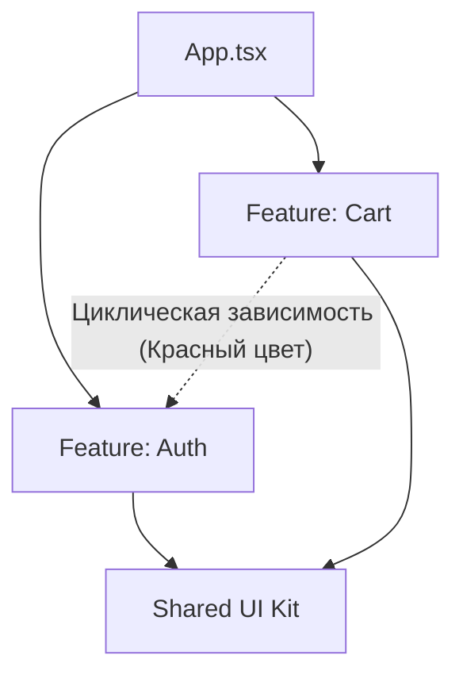

# Визуализация графа зависимостей

Визуализация графа зависимостей — это автоматическая генерация диаграмм (обычно в форматах SVG, HTML или интерактивных UI), которые показывают, как файлы, папки или целые npm-пакеты в проекте связаны (импортируют) друг с другом.

## Какую боль решаем?

Когда разработчик приходит в новый большой проект, папка `src/` для него — это "черный ящик". В ней могут быть сотни файлов. 
- С чего начинается выполнение кода?
- Какие модули являются "ядром" (их используют все), а какие — "листьями" (никто их не переиспользует)?
- Есть ли скрытые циклические зависимости?

Читать код глазами для поиска этих ответов — долго и больно. Визуализация дает вид "с высоты птичьего полета".

## Как это работает на практике

Для визуализации используются инструменты вроде **Madge**, **Dependency Cruiser** или встроенный **Nx Graph** (если вы используете монорепозиторий Nx).

Например, выполнив команду в терминале:
`npx madge --image graph.svg src/`

Вы получите картинку. Инструменты умеют раскрашивать узлы графа:
- **Зеленые:** модули без исходящих зависимостей (базовые утилиты, UI-кит).
- **Красные:** модули с циклическими зависимостями (где модуль А зависит от Б, а Б от А).
- **Орфанные (Одинокие):** файлы, которые никто не импортирует в проекте (мертвый код).

## Неочевидные нюансы и трейдоффы

1. **Проблема "Звезды Смерти" (Death Star).** Если натравить визуализатор на корень крупного проекта без фильтров, вы получите гигантское, нечитаемое черное пятно из тысяч пересекающихся линий. 
2. **Как правильно визуализировать:** 
   - Исключайте `node_modules` и файлы тестов.
   - Делайте агрегацию по папкам, а не по файлам (например, сворачивайте всю папку `src/features/auth` в один узел на графе).
   - Стройте графы для отдельных модулей (например, визуализируйте только то, от чего зависит `CartWidget`).
3. **Где ломается:** Визуализаторы анализируют статические импорты (`import x from 'y'`). Если в коде активно используются динамические импорты (`await import("'...'")`), инъекция зависимостей (DI-контейнеры) или глобальные переменные, граф не покажет реальной картины связей во время выполнения программы.
