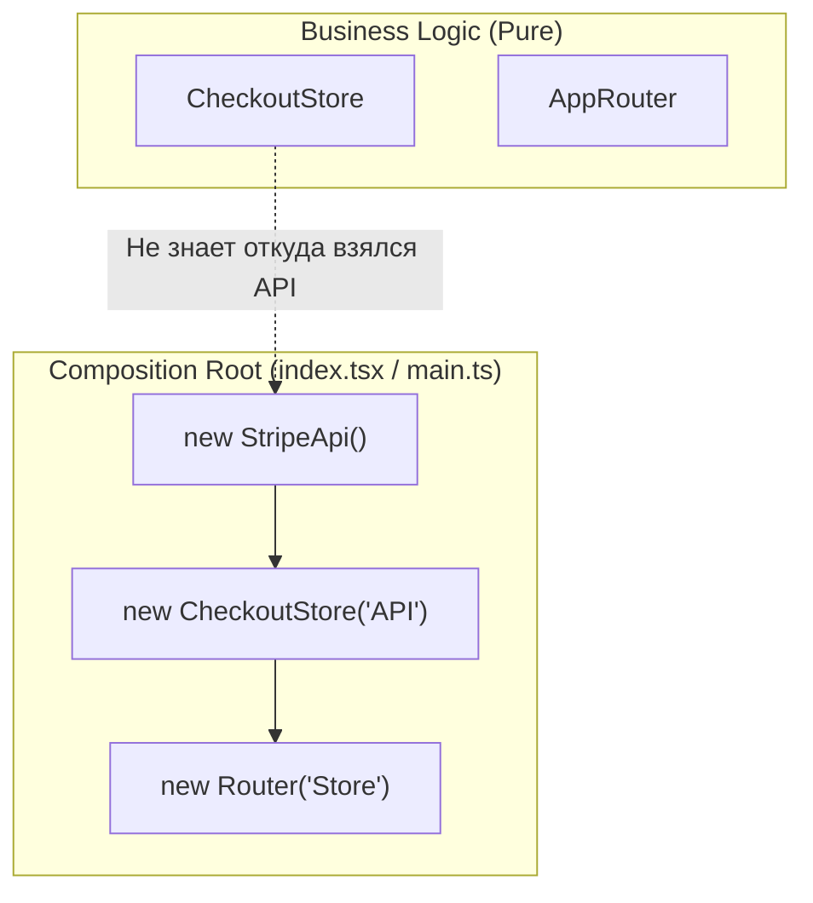

# Composition Root (Корень композиции)

Composition Root — это архитектурный паттерн, представляющий собой единое, централизованное место в приложении (обычно в самой точке входа), где происходит создание объектов и связывание зависимостей вместе (Dependency Injection) до того, как приложение начнет свою реальную работу.

## Какую боль решаем?

Если каждый модуль приложения сам создает (инстанцирует) свои зависимости, мы получаем **сильную связанность (Tight Coupling)**. 

Представьте компонент `Checkout`, который сам создает экземпляр клиента для оплаты:
```typescript
class CheckoutProcess {
    private paymentApi = new StripePaymentApi(); // ❌ Жесткая связка!
    
    pay() { this.paymentApi.charge("100"); }
}
```
Боль:
1. Вы не можете протестировать `CheckoutProcess`, не отправляя реальные запросы в Stripe (нельзя легко подсунуть мок-объект).
2. Вы не можете поменять Stripe на PayPal без изменения кода самого `CheckoutProcess`.

Composition Root выносит ответственность за создание зависимостей за пределы бизнес-логики.

## Как это работает на практике

Модули только *запрашивают* зависимости (через конструкторы или пропсы), а Composition Root занимается тем, что эти зависимости им *передает*.



**Правильное решение:**
```typescript
// 1. Модуль ничего не знает о создании. Он только требует интерфейс.
class CheckoutProcess {
    constructor("private paymentApi: IPaymentApi") {} 
}

// 2. Composition Root (например, src/main.ts) связывает всё воедино:
const env = process.env.NODE_ENV;
// В зависимости от окружения подсовываем нужную реализацию
const api = env === 'test' ? new MockPaymentApi() : new StripePaymentApi();

const checkout = new CheckoutProcess("api");
checkout.pay();
```

## Неочевидные нюансы и трейдоффы

1. **В React это выглядит иначе.** Во фронтенд-фреймворках (React, Vue) классический ООП-паттерн Composition Root часто скрыт. Его роль выполняют глобальные Context Providers (например, `<Provider store={store}>` или `<ThemeProvider>`), которые оборачивают корневой компонент `<App />` и "прокидывают" зависимости вниз по дереву.
2. **Разрастание (God Object).** Если в проекте 500 сервисов, корневой файл `main.ts` может раздуться до невероятных размеров. В этом случае Composition Root разбивают на логические части (модули регистрации) или используют мощные Inversion of Control (IoC) контейнеры (например, InversifyJS или встроенный DI в Angular).
3. **Где ломается:** В микрофронтендах каждый микро-апп должен иметь свой собственный Composition Root. Попытка сделать один Composition Root на весь кластер приведет к разрушению независимости команд.
