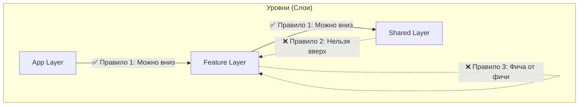

# Dependency Constraints (Ограничения зависимостей)

Dependency Constraints — это набор строгих архитектурных правил, определяющих, **кому и от кого разрешено зависеть** в кодовой базе. Это искусственные границы, которые архитекторы устанавливают для предотвращения хаоса.

## Какую боль решаем?

Без ограничений разработчики идут по пути наименьшего сопротивления. Если в модуле `Checkout` нужна функция форматирования карточки, которая уже есть в модуле `Profile`, разработчик просто импортирует её:
`import { formatCard } from '../../profile/utils'`.

Поздравляем, теперь `Checkout` зависит от `Profile`. Завтра кто-то сделает обратный импорт, и у вас появится **циклическая зависимость**. Кодовая база превратится в "Большой Комок Грязи" (Big Ball of Mud), где изменение одной строчки ломает приложение в совершенно неожиданном месте.

Dependency Constraints работают как "таможня" между модулями.



## Как это работает на практике

Во фронтенде самым ярким примером Dependency Constraints является методология **Feature-Sliced Design (FSD)**. В ней прописаны жесткие правила:
1. Вышестоящие слои могут использовать нижестоящие.
2. Нижестоящие слои **не могут** использовать вышестоящие.
3. Модули внутри одного слоя (например, разные Features) **не могут** зависеть друг от друга напрямую (cross-imports запрещены).

Эти правила автоматизируются с помощью линтеров (например, `eslint-plugin-boundaries` или `@nx/enforce-module-boundaries`).

**Пример нарушения Constraint'а:**
```tsx
// src/shared/ui/Button.tsx (Нижний слой)
import { CartIcon } from 'features/cart'; // ОШИБКА! Shared не может знать про фичи!
```

## Неочевидные нюансы и трейдоффы

1. **Замедление разработки.** Когда бизнесу нужна фича "вчера", ограничения бесят разработчиков. Чтобы переиспользовать код между двумя фичами, по правилам FSD нужно выносить этот код в слой `shared` или `entities`. Это требует рефакторинга, на который нет времени.
2. **Проблема дублирования (DRY vs Coupling).** Часто возникает выбор: нарушить constraint и сделать быстрый импорт (высокая связность) ИЛИ скопировать кусок кода в свой модуль (дублирование). В хорошей архитектуре *небольшое дублирование предпочтительнее жесткого зацепления*.
3. **Где применимо:** Ограничения зависимостей жизненно необходимы в проектах, которые планируют жить дольше 1-2 лет и разрабатываются командой от 5 человек.
