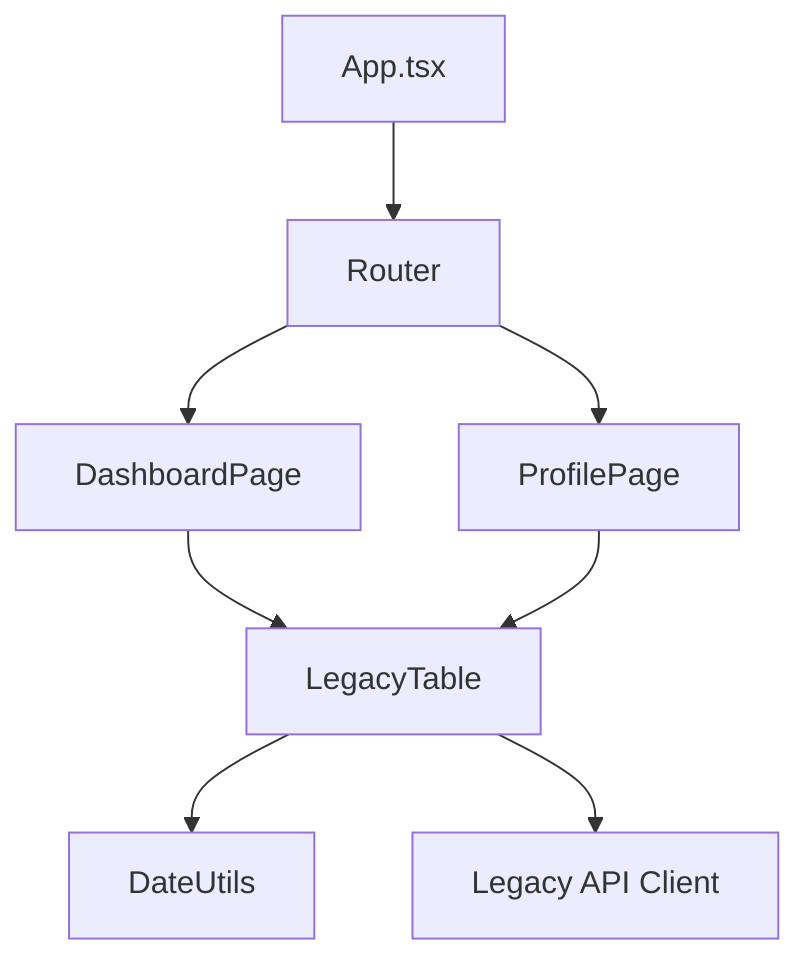

# Dependency Graph (Граф зависимостей)

Граф зависимостей (Dependency Graph) — это математическая модель, визуализирующая структуру вашего кода. В ней каждый **узел (node)** — это файл (или модуль/пакет), а каждое **ребро (edge)** — это импорт (зависимость) одного файла от другого.

## Какую боль решаем?

В современном фронтенде проект легко может состоять из 5 000 файлов. Если тимлид просит вас: "Удали старый компонент `LegacyTable`, он больше не нужен", вы не можете просто нажать `Delete`. Вы должны знать:
- А кто его использует? (Входящие зависимости)
- А что использует он сам? Можно ли удалить эти зависимости вместе с ним? (Исходящие зависимости)

Без графа зависимостей рефакторинг напоминает разминирование бомбы вслепую.

## Как это работает на практике

Идеальный граф зависимостей в архитектуре должен быть **Направленным Ациклическим Графом (DAG - Directed Acyclic Graph)**. Это означает, что зависимости должны течь в одном направлении и никогда не образовывать циклов (петель).

**Инструменты:**
Сборщики (Webpack, Vite) строят граф зависимостей под капотом, чтобы понять, в каком порядке склеивать файлы в бандл.
Разработчики могут анализировать граф визуально с помощью утилит вроде `madge` или `dependency-cruiser`.

**Пример использования (Поиск мертвого кода):**
Если в вашем графе есть узел (компонент `PromoBanner.tsx`), на который не указывает ни одна стрелка (нет входящих зависимостей, кроме, может быть, тестов) — это мертвый код (Orphan Node), его можно смело удалять.

## Неочевидные нюансы и трейдоффы

1. **Проблема циклических зависимостей (Circular Dependencies).** Это самая страшная болезнь графа. Файл А импортирует Б, Б импортирует В, В импортирует А. В JavaScript это может привести к тому, что при выполнении файла импортируемая переменная будет `undefined` (так как движок не смог разрешить цикл). Граф мгновенно показывает такие петли красным цветом.
2. **Динамические импорты.** Если вы используете React.lazy или `await import()`, эти связи могут не отображаться в простых статических графах зависимостей, так как они разрешаются только в рантайме.
3. **Размер графа.** На enterprise-проектах граф выглядит как гигантское черное пятно ("Death Star"). Работать с ним на уровне файлов невозможно. Поэтому в хорошей архитектуре граф анализируют **на уровне модулей** (пакетов), а не отдельных файлов.
