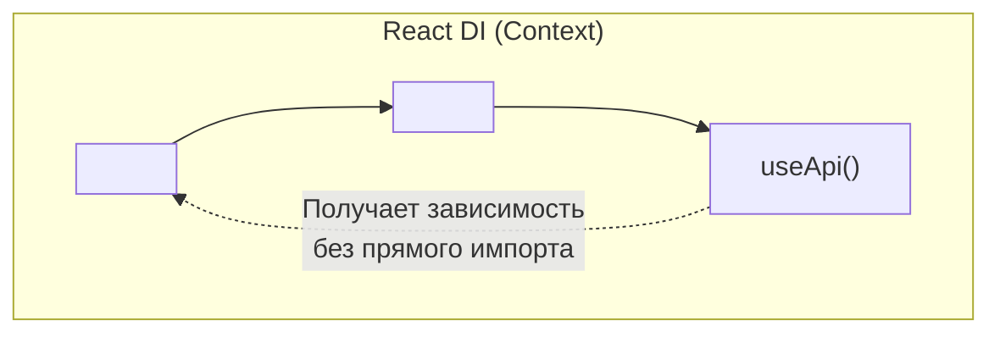

# Dependency Injection (Внедрение зависимостей)

Dependency Injection (DI) — это паттерн проектирования, при котором объект или функция не создает свои зависимости (например, сервисы API) самостоятельно, а **получает их извне**.

## Какую боль решаем?

Классическая проблема "жесткого связывания" (Tight Coupling).

**Антипаттерн (Жесткая связка):**
```typescript
import { api } from './globalApi';

class UserService {
    // Метод сам берет глобальный объект. Мы прибиты гвоздями к 'api'
    async getUser() {
        return await api.get('/user'); 
    }
}
```
**Боль:** Как протестировать `UserService`? Нам придется поднимать мок-сервер (MSW) или использовать грязные хаки вроде `jest.mock('./globalApi')`. Если мы захотим использовать `UserService` с другим клиентом (например, GraphQL вместо Axios), придется переписывать класс.

DI решает это, прокидывая зависимость снаружи:

```typescript
// Правильное решение (DI через конструктор):
class UserService {
    // Класс просит зависимость, но не знает, как она создается
    constructor(private api: ApiClient) {}
    
    async getUser() {
        return await this.api.get('/user');
    }
}

// В тестах:
const mockApi = { get: () => Promise.resolve({ name: "John" }) };
const service = new UserService(mockApi); // Легко тестировать!
```

## Как это работает во Фронтенде

В ООП (Angular, NestJS) для DI используются мощные IoC-контейнеры с декораторами (например, `tsyringe` или `inversify`).
В функциональном мире **React** роль Dependency Injection часто выполняет **Context API** или кастомные хуки.



**Пример в React:**
Вместо импорта глобального стора или API клиента прямо в компонент, мы "инжектим" его через контекст.
```tsx
const UserProfile = () => {
   // Компонент не знает, КАКОЙ ИМЕННО api он получил (настоящий или мок)
   const api = useContext(ApiContext); 
   // ...
}
```

## Неочевидные нюансы и трейдоффы

1. **Prop Drilling.** Если не использовать Контекст или DI-контейнеры, вам придется прокидывать зависимости через параметры функций (или React props) на 10 уровней вниз. Это ад.
2. **Оверхед на абстракции.** Во фронтенде DI часто считают "оверинжинирингом". Для простого приложения импортировать `axios` напрямую в `useEffect` — нормально. DI нужен там, где есть сложная бизнес-логика (Domain Layer), которая должна быть покрыта юнит-тестами на 100%.
3. **Невидимые зависимости.** При использовании React Context (как формы DI) зависимости становятся неявными. Если вы забудете обернуть компонент в Provider, приложение упадет в рантайме (а не во время сборки).
