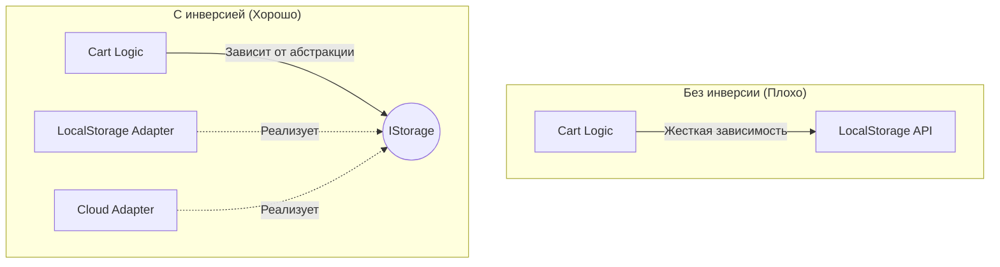

# Dependency Inversion (Инверсия зависимостей)

Инверсия зависимостей (Буква **D** в принципах S.O.L.I.D.) — это принцип, который гласит:
1. Модули верхних уровней (бизнес-логика) **не должны зависеть** от модулей нижних уровней (инфраструктура, БД, UI).
2. И те, и другие должны зависеть от **абстракций** (интерфейсов).

## Какую боль решаем?

Представьте, что вы пишете бизнес-логику корзины. Чтобы сохранить её, вы напрямую импортируете клиент `LocalStorage`.
Проходит полгода. Бизнес говорит: "Теперь корзина должна синхронизироваться с облаком через `Axios`". Вам приходится переписывать всю бизнес-логику, выковыривая оттуда `LocalStorage` и вставляя `Axios`.

Вы нарушили принцип: ваша чистая бизнес-логика (верхний уровень) зависела от конкретной реализации хранилища (нижний уровень).



## Как это работает на практике

Мы инвертируем ("переворачиваем") направление зависимости с помощью интерфейсов.

**Антипаттерн:**
```typescript
import { axios } from 'axios';

class OrderService {
  // Бизнес-логика жестко завязана на Axios. Поменять на fetch - огромная боль.
  createOrder(data) {
    return axios.post('/api/orders', data);
  }
}
```

**Правильное решение (Dependency Inversion + Injection):**
```typescript
// 1. Создаем абстракцию (Интерфейс) в слое бизнес-логики
interface IHttpClient {
  post(url: string, data: any): Promise<any>;
}

// 2. Бизнес-логика зависит ТОЛЬКО от абстракции
class OrderService {
  constructor(private http: IHttpClient) {} // DI
  
  createOrder(data) {
    return this.this.http.post('/api/orders', data); // Не знает, что там: Axios или Fetch!
  }
}

// 3. Инфраструктура реализует абстракцию
class AxiosAdapter implements IHttpClient {
  post(url, data) { return axios.post(url, data); }
}
```

## Неочевидные нюансы и трейдоффы

1. **Умножение файлов.** Чтобы инвертировать зависимость, вам нужно создать минимум три сущности: Класс логики, Интерфейс абстракции и Класс-адаптер (реализацию). Для простых проектов это колоссальный оверхед (Boilerplate).
2. **Абстракции часто протекают.** Сложно написать идеальный `IHttpClient`, который учтет все нюансы (например, отмену запросов `AbortController` или прогресс загрузки файлов). Часто детали реализации всё равно просачиваются в интерфейс.
3. **Где применимо:** Паттерн жизненно необходим в слое домена (Domain) при использовании Clean Architecture (Гексагональной архитектуры). Бизнес-логика должна быть "глуха и слепа" к тому, где она исполняется: в браузере, на Node.js или в тестах.
