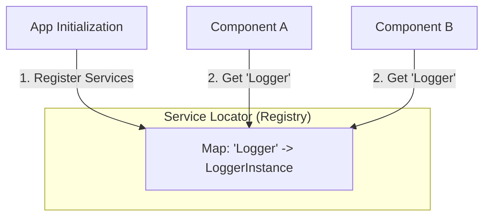

# Service Locator (Локатор служб)

Service Locator — это паттерн проектирования, который предоставляет централизованный реестр (глобальный объект или синглтон), где регистрируются все сервисы и зависимости приложения. Любой компонент может обратиться к этому реестру и запросить нужный ему сервис по ключу или токену.

## Какую боль решаем?

В глубоком дереве React-компонентов (или в сложной цепочке функций) вам нужно получить доступ к `AnalyticsService`.

Если использовать чистый Dependency Injection (пробрасывание через пропсы), вам придется передавать `AnalyticsService` через 10 промежуточных компонентов, которым он не нужен (Prop Drilling). Это засоряет код.

Service Locator позволяет сделать "магический вызов" прямо там, где это нужно:
```typescript
class CheckoutProcess {
    pay() {
        // Запрашиваем сервис у глобального Локатора
        const api = ServiceLocator.get<PaymentApi>('PaymentApi');
        api.charge(100);
    }
}
```

## Как это работает на практике



Пример простейшего Локатора:
```typescript
class Locator {
    private static services = new Map<string, any>();

    static register(name: string, instance: any) {
        this.services.set(name, instance);
    }

    static get<T>(name: string): T {
        if (!this.services.has(name)) throw new Error(`Service ${name} not found`);
        return this.services.get(name) as T;
    }
}

// При старте приложения
Locator.register('Logger', new ConsoleLogger());

// В любом месте приложения
const logger = Locator.get<ILogger>('Logger');
```

## Неочевидные нюансы: почему это Антипаттерн?

В современном мире Service Locator чаще всего считается **антипаттерном**. 
Трейдоффы и проблемы, которые он создает, перевешивают его плюсы:

1. **Скрытые зависимости.** Глядя на сигнатуру класса `class CheckoutProcess`, вы не знаете, что для его работы нужен `PaymentApi`. Это выяснится только в рантайме, когда код упадет с ошибкой "Service not found".
2. **Сложность тестирования.** Чтобы протестировать компонент, использующий Локатор, вам нужно обязательно инициализировать глобальный Локатор и "подсунуть" туда моки. Поскольку Локатор глобальный, тесты могут начать влиять друг на друга (нарушение изоляции тестов), если вы забудете очищать Локатор после каждого тест-кейса.
3. **Альтернативы лучше.** В React проблему Prop Drilling решает **Context API**, который является формой Dependency Injection, привязанной к дереву рендера. В ООП-мире (Angular) используют IoC-контейнеры, которые инжектят зависимости через конструктор, делая их явными и легко тестируемыми.
