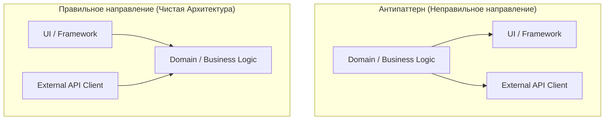

# Направление зависимостей

Правильное направление зависимостей — это фундаментальный закон любой масштабируемой архитектуры. Главное правило: **Зависимости всегда должны быть направлены от изменчивых (нестабильных) модулей к стабильным (ядерным).**

## Какую боль решаем?

Представьте, что вы написали идеальную функцию для расчета скидок (Ядро бизнеса, Домен). 
Но внутри этой функции вы решили заиспользовать хук `useParams()` из React Router (чтобы достать ID товара) или функцию `toast.success()` из UI-библиотеки.

Вы только что сделали так, что **стабильная бизнес-логика стала зависеть от нестабильной инфраструктуры (UI)**.
Боль наступает, когда:
1. Вы решаете переписать UI с React на Vue (или на React Native) — вам придется переписывать расчет скидок.
2. Вы пытаетесь написать Unit-тест на расчет скидок — тест падает, потому что просит обернуть его в `<BrowserRouter>` из-за `useParams`.

## Как это работает на практике

Во фронтенде слои по степени "стабильности" обычно располагаются так (от самого нестабильного к стабильному):
1. **UI / View (React, Vue, DOM)** — меняется каждый день (дизайнер подвинул кнопку).
2. **Infrastructure (API, LocalStorage)** — меняется редко (переехали на GraphQL).
3. **Application Layer (Use Cases, Thunks)** — меняется, когда меняются бизнес-процессы.
4. **Domain Layer (Entities, Pure Logic)** — меняется только тогда, когда фундаментально меняются законы бизнеса предприятия.

**Правило:** Слой 1 может импортировать Слой 4. Слой 4 **не имеет права** импортировать ничего из слоев 1, 2 и 3.

В методологии **Feature-Sliced Design (FSD)** направление зависимостей также строго регламентировано сверху вниз:
`app -> pages -> widgets -> features -> entities -> shared`.
Shared (утилиты и UI-кит) — самый стабильный слой. Он ничего не знает о фичах или страницах.

## Неочевидные нюансы и трейдоффы

1. **Как инвертировать зависимость?** Если Домену СРОЧНО нужно отправить HTTP-запрос (Инфраструктура), как это сделать, не нарушив правило направления? Ответ: **Dependency Inversion (Инверсия зависимостей)**. Домен объявляет *интерфейс* `IHttpClient`, а Инфраструктура реализует его и прокидывает в Домен (Dependency Injection).
2. **Оверхед.** Постоянное соблюдение правильного направления зависимостей заставляет плодить интерфейсы и мапперы. Для лендинга или проекта-однодневки это избыточно. Для Enterprise — это единственный способ выжить.
3. **Контроль.** Направление зависимостей невозможно удержать в голове. Оно должно жестко контролироваться линтерами (ESLint Boundaries) или инструментами статического анализа (Dependency Cruiser) на уровне CI/CD.
