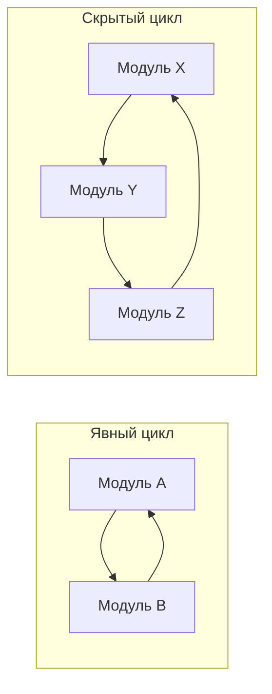

# Циклические зависимости

Циклическая зависимость (Circular Dependency) — это архитектурная аномалия, при которой два или более модуля прямо или косвенно ссылаются друг на друга, образуя замкнутый круг (петлю). 

## Какую боль решаем?

Циклы в JavaScript/TypeScript коварны. Часто они даже не вызывают ошибок при компиляции (Typescript может проглотить циклический импорт типов). Но в **Runtime (во время выполнения)** происходит следующее:

Модуль А начинает загружаться -> видит импорт модуля Б -> парсит модуль Б -> видит импорт модуля А -> но модуль А еще не загружен до конца! 
В результате модуль Б получает вместо экспортированной функции `undefined`. Вы получаете загадочную ошибку в консоли: `Cannot read properties of undefined (reading 'init')`.

Также циклы ломают сборщики бандлов (Webpack/Vite не могут правильно сделать Tree-shaking) и сводят с ума инструменты статического анализа.



## Причины возникновения и как это работает

Чаще всего циклы возникают из-за:
1. **Отсутствия архитектурных слоев.** Если нет правила "кто от кого зависит", компоненты начинают импортировать друг друга хаотично.
2. **Неправильных Barrel Exports (`index.ts`).** Когда файлы внутри одной папки импортируют друг друга не по относительным путям (`./utils`), а через общий фасад папки (`../index.ts`).
3. **Раздутых (God) модулей.** Когда в одном файле лежит слишком много логики, он неизбежно начинает тянуть связи отовсюду.

**Антипаттерн:**
```typescript
// user.ts
import { fetchCompany } from './company';
export const getUser = () => { /* ... */ };

// company.ts
import { getUser } from './user'; // ❌ ЦИКЛ!
export const fetchCompany = () => { /* ... */ };
```

## Как разрубить цикл (Трейдоффы и решения)

1. **Вынесение в третий (общий) модуль.**
Самый правильный способ. Если `user` и `company` нужны друг другу, скорее всего, у них есть общая логика. Выносим её в `shared.ts`.
Теперь: `user -> shared`, `company -> shared`. Цикла нет.
*Трейдофф: появление "мусорных" файлов (utils, helpers), размывающих доменные границы.*

2. **Слияние модулей.**
Если два модуля так сильно зависят друг от друга, возможно, искусственное разделение было ошибкой. Слейте их в один файл (или одну папку с тесным cohesion).
*Трейдофф: файл может раздуться до 1000+ строк.*

3. **Инверсия зависимостей (Dependency Inversion).**
Вместо прямого импорта модуля А в модуль Б, модуль Б объявляет интерфейс того, что ему нужно, а модуль А передает (инжектит) реализацию во время старта приложения.
*Трейдофф: усложнение кода (IoC, абстракции).*

**Инструменты для борьбы:**
Никогда не ищите циклы глазами. Настройте `eslint-plugin-import` (правило `import/no-cycle`) или `dependency-cruiser` в CI/CD пайплайне.
