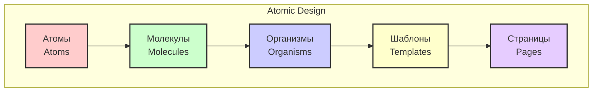
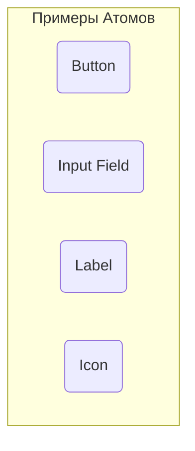
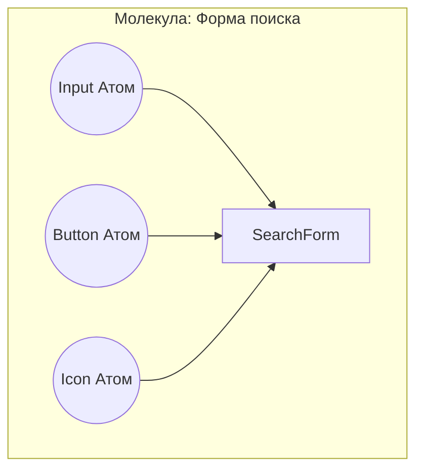
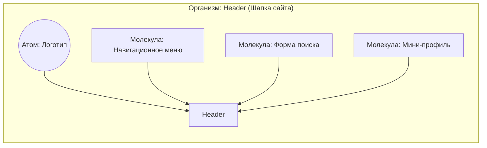
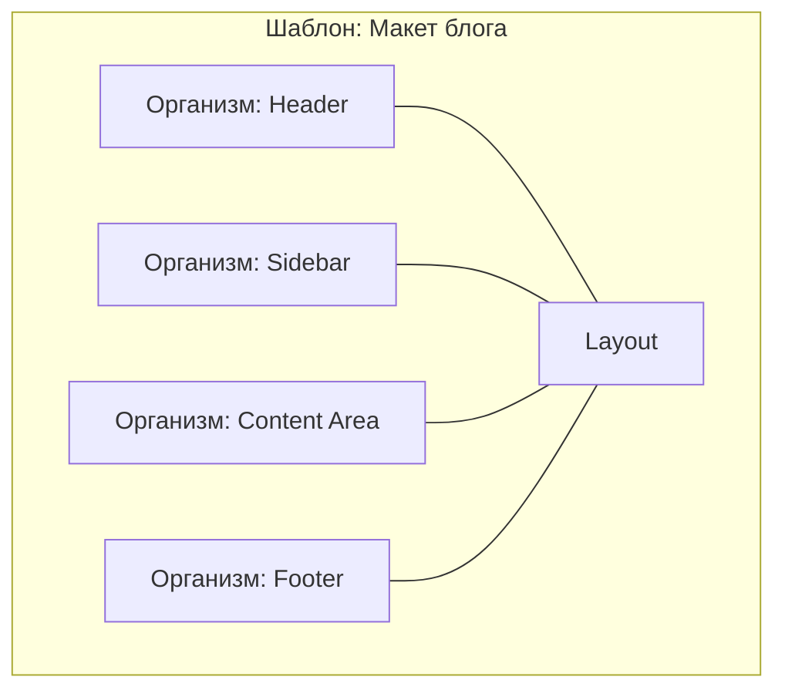
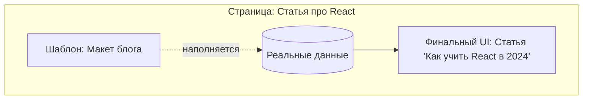

# Atomic Design

**Atomic Design** (Атомарный дизайн) — это методология, предложенная Брэдом Фростом (Brad Frost) для создания дизайн-систем и структурирования UI-компонентов. Она проводит аналогию с химией и помогает разбивать сложные интерфейсы на фундаментальные строительные блоки.

Основная цель Atomic Design — создать масштабируемую, переиспользуемую и легко поддерживаемую библиотеку компонентов (UI-kit), которая обеспечивает единый визуальный язык между дизайнерами и разработчиками.

## Общая иерархия (Диаграмма)

Методология разделяет весь UI на 5 строгих уровней, собирающихся от малого к великому:

---

## Подробный разбор уровней с примерами

### 1. Атомы (Atoms)
Базовые, неделимые строительные блоки. Сами по себе они не несут сложной бизнес-логики и не могут быть разбиты на более мелкие UI-элементы без потери смысла.

*   **Особенности:** Максимально универсальны, переиспользуются везде. Настраиваются через пропсы (цвет, размер, состояние disable).

### 2. Молекулы (Molecules)
Группы атомов, объединенные вместе для выполнения одной небольшой, конкретной функции. Они формируют простые составные элементы интерфейса (Single Responsibility).

### 3. Организмы (Organisms)
Относительно сложные UI-компоненты, формирующие самостоятельные блоки интерфейса. Состоят из групп молекул, атомов и/или других организмов.

*   **Особенности:** Могут содержать в себе определенную логику отображения, часто привязаны к контексту использования.

### 4. Шаблоны (Templates)
Группы организмов, объединенные в структуру (layout) страницы. Здесь еще нет реальных данных, это "скелет", определяющий, как компоненты располагаются друг относительно друга и сетку страницы.

### 5. Страницы (Pages)
Конкретные экземпляры шаблонов, наполненные реальным контентом и данными.

*   **Особенности:** На этом уровне компоненты связываются с бизнес-логикой, API и хранилищем состояний (State Management). Это то, что в итоге видит пользователь.

---

## Плюсы и Минусы

**Преимущества:**
*   **Переиспользуемость:** Снижение дублирования кода.
*   **Единый язык:** Упрощает коммуникацию между дизайном (Figma) и разработкой (React/Vue/Angular).
*   **Масштабируемость:** Легко собирать новые интерфейсы из готовых блоков.
*   **Изолированность:** Проще тестировать отдельные компоненты (Storybook/Unit-тесты).

**Недостатки:**
*   **Размытые границы:** Часто сложно определить разницу между сложной молекулой и простым организмом (вызывает споры в команде).
*   **Избыточность для малых проектов:** Для небольших приложений строгая иерархия может быть оверхедом.
*   Не решает проблемы архитектуры бизнес-логики и работы со стейтом.

## Связь с другими архитектурами (FSD)
В современных фронтенд-архитектурах (например, в **Feature-Sliced Design**) компоненты Atomic Design обычно живут на слое `Shared/UI`. Там они реализуются как "глупые" (dumb/presentational) компоненты, которые ничего не знают о бизнес-контексте приложения и управляются исключительно через пропсы.
