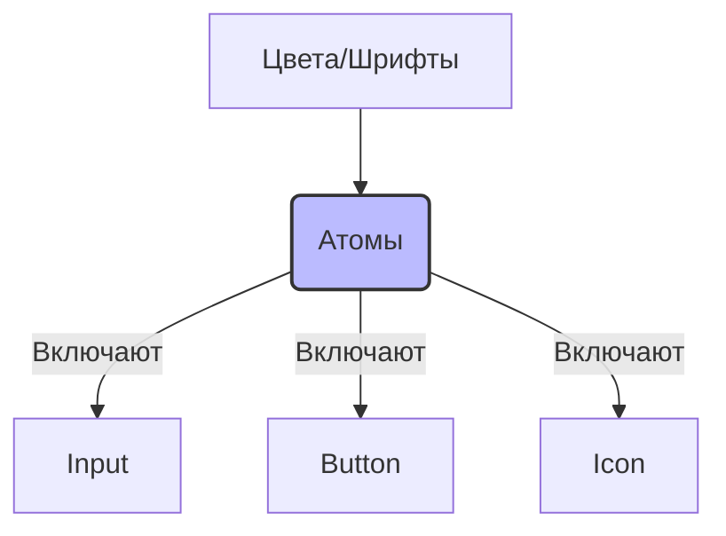

# Atoms (Атомы) в Atomic Design

## Суть: Неделимые элементы интерфейса
В химии атом — мельчайшая частица. В Frontend-архитектуре (Atomic Design) атомы — это базовые строительные блоки UI. Это кнопки, инпуты, лейблы, иконки, а также абстрактные элементы вроде цветовых палитр или типографики. Они не имеют смысла без контекста, но именно из них строится весь интерфейс.

Главная боль, которую решают атомы — дублирование стилей. Если везде использовать единый компонент `<Button />`, то редизайн приложения сведётся к изменению одного файла.

## Как это работает на практике
Атомы должны быть максимально "глупыми" (dumb components). Они ничего не знают о бизнес-логике, Redux, API или состоянии приложения. Они принимают пропсы и рендерят UI.



## Примеры кода

**Антипаттерн: Умный атом**
Атом не должен делать запросы к API или иметь сложный стейт.
```tsx
// ❌ Плохо: Кнопка сама отправляет аналитику или знает о бизнес-логике
const BuyButton = ({ productId }) => {
  const handleClick = () => api.post(`/buy/${productId}`);
  return <button onClick={handleClick}>Купить</button>;
};
```

**Правильное решение: Чистый атом**
```tsx
// ✅ Хорошо: Переиспользуемая UI-кнопка
const Button = ({ variant = 'primary', onClick, children }) => {
  return (
    <button className={`btn btn-${variant}`} onClick={onClick}>
      {children}
    </button>
  );
};
```

## Неочевидные нюансы
- **Оверхед на абстракции:** Не нужно создавать компонент `<Paragraph>` для простого тега `<p>`, если он не несёт дополнительной дизайн-логики.
- **Сложность пропсов:** Попытка сделать атом "на все случаи жизни" приводит к тому, что кнопка начинает принимать 20 пропсов. Лучше создать несколько специализированных атомов (например, `IconButton` и `TextButton`).
