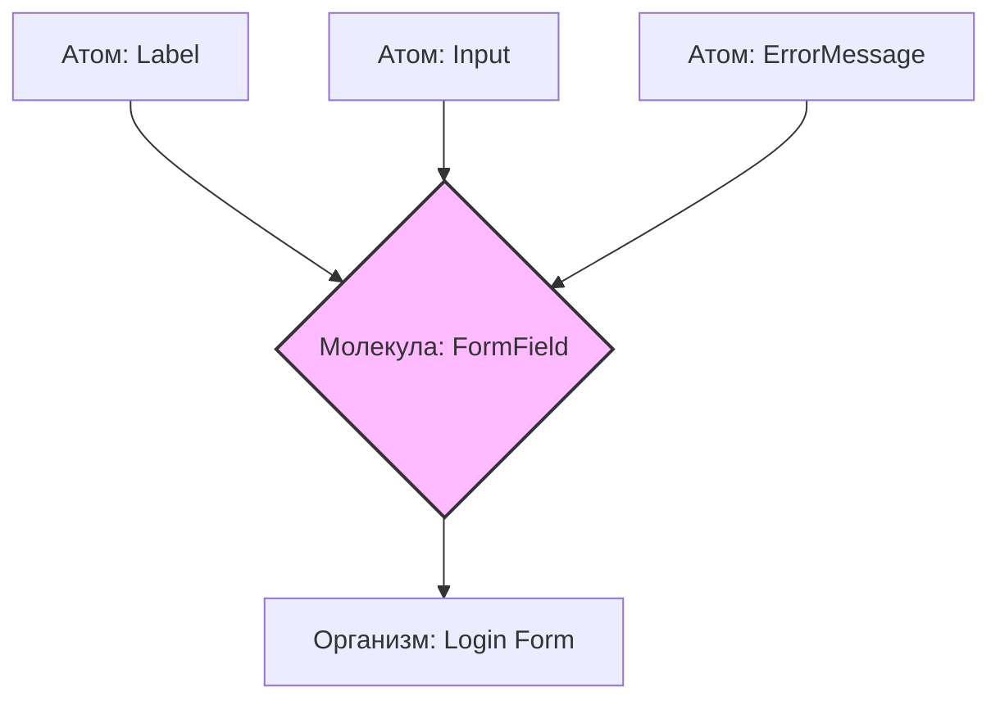

# Molecules (Молекулы) в Atomic Design

## Суть: Функциональные группы атомов
Молекулы — это группы из двух или более атомов, объединённые для выполнения одной конкретной функции. Если атом (инпут) сам по себе бесполезен, то вместе с другим атомом (кнопкой и лейблом) они создают форму поиска — молекулу.

Мы решаем боль связывания базовых элементов в переиспользуемые UI-компоненты. Молекулы берут на себя ответственность за компоновку атомов: отступы между ними, выравнивание и базовое взаимодействие.

## Как это работает на практике
Молекулы могут управлять небольшим локальным состоянием (например, открыт/закрыт дропдаун или значение инпута), но они по-прежнему не должны знать о глобальном стейте приложения (Redux/MobX) или делать сетевые запросы.



## Примеры кода

**Антипаттерн: Слишком сложная молекула**
```tsx
// ❌ Плохо: Молекула стала слишком сложной и начала тянуть данные
const UserProfileCard = () => {
  const { user } = useQuery('/api/user/me');
  return (
    <div className="card">
      <Avatar src={user.avatar} /> {/* Атом */}
      <Typography>{user.name}</Typography> {/* Атом */}
    </div>
  );
};
```

**Правильное решение: Композиция атомов**
```tsx
// ✅ Хорошо: Молекула отвечает только за компоновку и локальное поведение
const SearchBar = ({ onSearch }) => {
  const [query, setQuery] = useState('');
  
  return (
    <div className="search-bar">
      <Input value={query} onChange={(e) => setQuery(e.target.value)} />
      <Button onClick={() => onSearch(query)}>Найти</Button>
    </div>
  );
};
```

## Неочевидные нюансы
- **Граница между молекулой и организмом:** Это самая частая проблема в Atomic Design. Если компонент начинает разрастаться и объединять разные бизнес-сущности — скорее всего, это уже Организм.
- **Layout-логика:** Молекулы не должны задавать свои внешние отступы (margin). Они должны позиционировать элементы только *внутри* себя, чтобы быть переиспользуемыми в любых контекстах.
