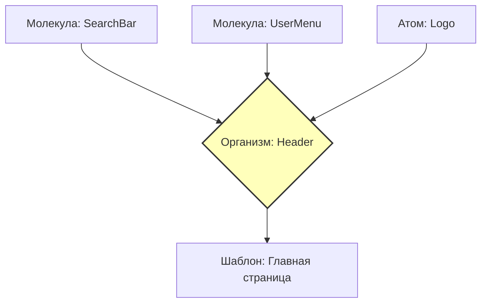

# Organisms (Организмы) в Atomic Design

## Суть: Самостоятельные блоки интерфейса
Если молекулы — это простые комбинации элементов (например, форма поиска), то организмы — это сложные, законченные секции интерфейса. Хедер, футер, боковая панель, карточка товара с кучей логики — всё это организмы. 

Они решают боль композиции крупных фичей. Организм можно взять и целиком перенести на другую страницу, и он будет работать как единый механизм.

## Как это работает на практике
Организмы объединяют в себе атомы, молекулы и иногда даже другие организмы. В отличие от "глупых" атомов, организмы могут иметь связь с бизнес-логикой или глобальным состоянием (хотя в идеале лучше передавать данные сверху).



## Примеры кода

**Антипаттерн: Монолитный организм**
```tsx
// ❌ Плохо: Организм сам рендерит всю мелкую разметку, не переиспользуя молекулы
const Header = () => {
  return (
    <header>
      
      <div className="search">
         <input type="text" />
         <button>Найти</button>
      </div>
    </header>
  );
};
```

**Правильное решение: Композиция молекул и атомов**
```tsx
// ✅ Хорошо: Организм собирается из готовых блоков
const Header = ({ user }) => {
  return (
    <header className="app-header">
      <Logo />
      <SearchBar onSearch={api.search} />
      <UserMenu user={user} />
    </header>
  );
};
```

## Неочевидные нюансы
- **Падение переиспользуемости:** Организмы часто привязаны к конкретному контексту (например, "Хедер админки"). Не пытайтесь сделать их такими же универсальными, как кнопки.
- **Холивары в команде:** Граница между сложной молекулой и простым организмом очень тонка. Часто разработчики тратят часы на споры, куда положить компонент.
