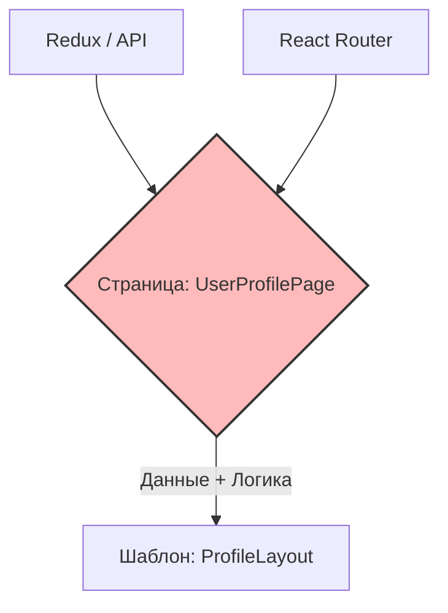

# Pages (Страницы) в Atomic Design

## Суть: Интеграция данных и UI
Страницы — это высший и самый конкретный уровень методологии. Если шаблоны — это пустой каркас, то страницы берут этот каркас и вливают в него жизнь: реальные данные из API, состояние из Redux/Zustand, роутинг и бизнес-логику. 

Здесь решается боль оркестрации: страницы выступают в роли "контроллеров", которые соединяют "тупой" UI с умными сервисами.

## Как это работает на практике
Страница обычно мапится на конкретный URL (например, `/users/:id`). Она загружает данные, обрабатывает состояния загрузки/ошибки и передает всё это вниз — в шаблоны и организмы.



## Примеры кода

**Антипаттерн: Раздутая страница (Fat Controller)**
```tsx
// ❌ Плохо: Страница сама верстает весь интерфейс и смешивает логику с UI
const UserPage = () => {
  const { data } = useFetch('/user');
  return (
    <div>
      <nav>...</nav>
      <main>
        <h1>{data.name}</h1>
        <button onClick={...}>Edit</button>
      </main>
    </div>
  );
};
```

**Правильное решение: Страница как связующее звено**
```tsx
// ✅ Хорошо: Страница делегирует UI шаблону
const UserPage = () => {
  const { data, isLoading } = useFetch('/user');

  if (isLoading) return <LoadingTemplate />;

  return (
    <ProfileTemplate 
      header={<Header user={data} />}
      main={<UserInfoCard user={data} />}
    />
  );
};
```

## Неочевидные нюансы
- **Проблема Prop Drilling:** Так как страница собирает все данные, их приходится прокидывать глубоко вниз через шаблоны и организмы. Это лечится использованием Context API или умных организмов (которые сами подключаются к стору).
- **Сайд-эффекты:** Только на этом уровне (и иногда в умных организмах) должны находиться вызовы `useEffect` для фетчинга данных.
