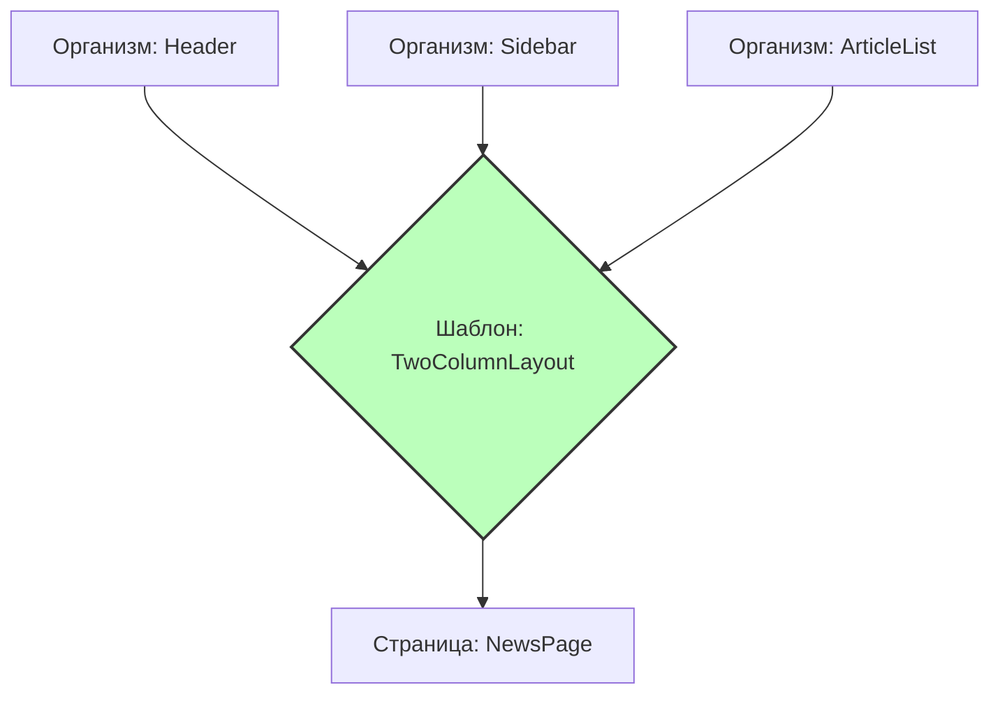

# Templates (Шаблоны) в Atomic Design

## Суть: Каркас без данных
Шаблоны — это первый этап Atomic Design, где мы перестаём мыслить абстрактными компонентами и начинаем видеть макет (layout) страницы. Шаблон определяет, как организмы и молекулы располагаются на экране: где будет хедер, как работает сетка, где находится сайдбар. Главная особенность шаблона — в нём нет реальных данных, это просто "скелет" (wireframe) или контейнер со слотами.

Мы решаем боль дублирования верстки страниц. Если у нас 10 страниц с одинаковым двухколоночным макетом, мы выносим макет в шаблон.

## Как это работает на практике
Шаблон принимает React-элементы через пропсы (например, `children`, `sidebarContent`, `headerContent`) и раскладывает их по CSS-сетке.



## Примеры кода

**Антипаттерн: Шаблон с захардкоженным контентом**
```tsx
// ❌ Плохо: Шаблон знает, какие конкретно данные он рендерит
const DashboardTemplate = () => {
  return (
    <div className="layout">
      <Header />
      <SidebarLinks />
      <main>
         <RecentTransactionsList />
      </main>
    </div>
  );
};
```

**Правильное решение: Универсальный каркас**
```tsx
// ✅ Хорошо: Шаблон предоставляет слоты для контента
const TwoColumnTemplate = ({ header, sidebar, main }) => {
  return (
    <div className="layout">
      {header}
      <aside className="layout-sidebar">{sidebar}</aside>
      <main className="layout-main">{main}</main>
    </div>
  );
};
```

## Неочевидные нюансы
- **Часто пропускаемый слой:** Во многих проектах слой Templates просто выкидывают, собирая макет сразу на уровне Pages. Это нормально, если в приложении мало уникальных страниц, но плохо для CMS-подобных проектов.
- **Layout shift:** Шаблоны должны задавать строгие размеры контентных областей, чтобы избежать прыжков верстки (Cumulative Layout Shift) при загрузке реальных данных на уровне страниц.
