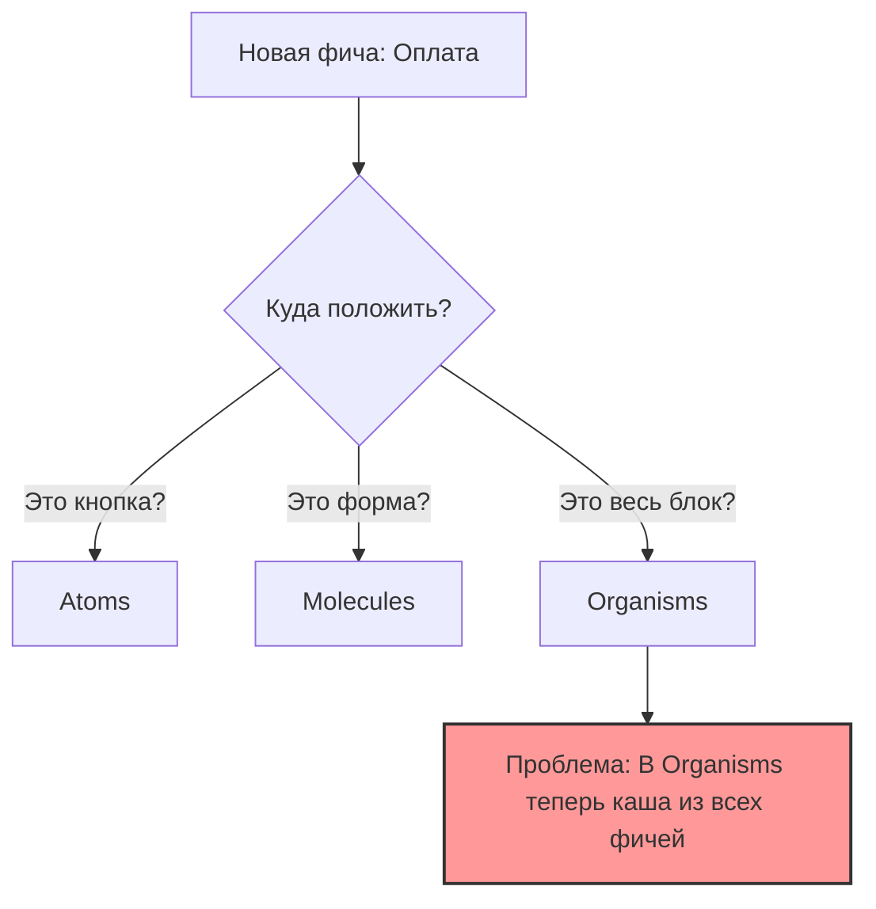

# Ограничения Atomic Design

## Суть: Почему Atomic Design ломается?
Atomic Design был придуман Брэдом Фростом для создания **UI-китов и дизайн-систем**, а не для архитектуры сложных веб-приложений. Когда мы пытаемся натянуть концепцию атомов и молекул на бизнес-логику, Redux-сторы и микрофронтенды, система начинает трещать по швам.

Главная боль: Atomic Design описывает *визуальную* композицию, но полностью игнорирует *доменную (бизнес)* область приложения.

## Как это работает на практике (как оно ломается)
В большом проекте у вас появится папка `organisms`. Через год в ней будет 200 компонентов из совершенно разных бизнес-доменов: `PaymentForm`, `UserAvatar`, `ProductGrid`, `ChatWindow`. Найти что-то становится невозможно. 



## Примеры кода

**Антипаттерн: Разделение бизнес-сущности по визуальным слоям**
```text
// ❌ Плохо: Сущность "Пользователь" размазана по всему проекту
src/
  atoms/UserAvatar/
  molecules/UserCard/
  organisms/UserList/
  pages/UserPage/
// Если мы удаляем фичу "Пользователь", нам нужно бегать по всем папкам.
```

**Правильное решение: Взгляд в сторону FSD / Feature Folders**
```text
// ✅ Хорошо: Группировка по смыслу, а не по виду (как в других методологиях)
src/
  features/
    User/
      ui/ (здесь лежат локальные компоненты юзера)
      api/
      model/
```

## Неочевидные нюансы
- **Когнитивная нагрузка:** Команда тратит больше времени на споры "это молекула или организм?", чем на написание кода.
- **Где хранить логику:** В Atomic Design нет папок для хуков, утилит, стейт-менеджеров. Разработчики придумывают свои решения, из-за чего каждый проект на Atomic Design выглядит по-разному.
- **Вывод:** Используйте Atomic Design **только** для папки `components/ui` (или `shared/ui`), но не стройте на нём архитектуру всего приложения.
