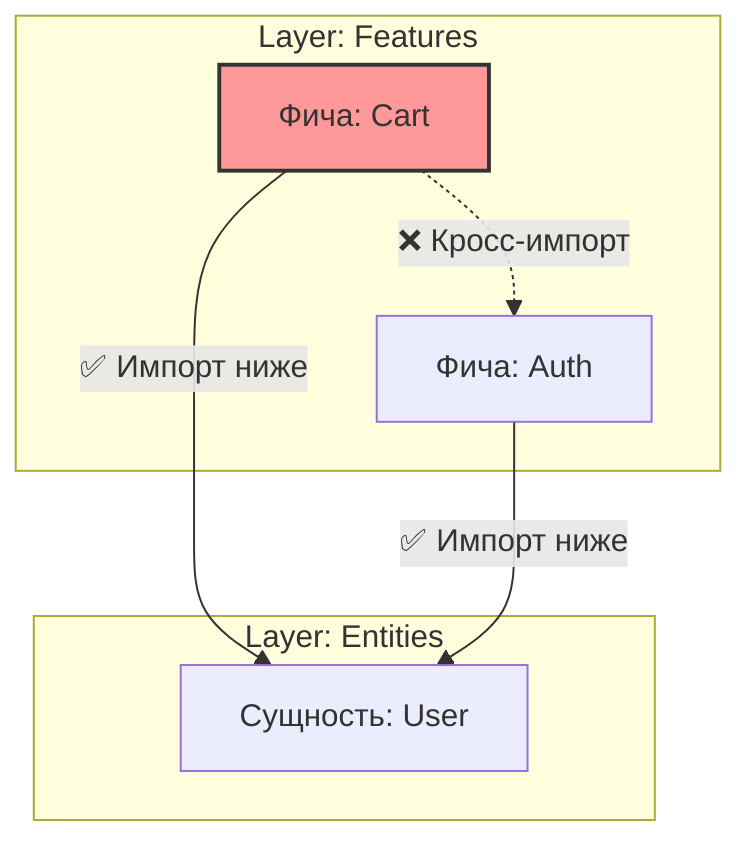

# Кросс-импорты в Feature Sliced Design

## Суть: Изоляция соседних модулей
В FSD действует строгое правило направленности зависимостей: слой может импортировать только из слоёв, находящихся ниже него. Но есть и второе, не менее важное правило: **модули (слайсы) внутри одного слоя не могут импортировать друг друга**. 

Мы решаем боль запутанного кода (Spaghetti Code) и циклических зависимостей. Если фича "Корзина" зависит от фичи "Авторизация", а "Авторизация" от "Корзины", мы не сможем их разделить или протестировать по отдельности.

## Как это работает на практике
Если двум фичам нужна общая логика, она должна быть спущена на слой ниже — в Entities (Сущности) или Shared (Общие компоненты).



## Примеры кода

**Антипаттерн: Фича импортирует Фичу**
```ts
// ❌ Плохо: Жесткое зацепление
// features/cart/ui/CartList.tsx
import { AuthModal } from 'features/auth';

export const CartList = () => (
  <div>
    <AuthModal /> {/* Если уберём фичу Auth, CartList сломается */}
  </div>
);
```

**Правильное решение: Вынос общего стейта или композиция**
```ts
// ✅ Хорошо: Композиция на уровне Widgets или Pages
// widgets/Header/ui.tsx
import { AuthModal } from 'features/auth';
import { CartButton } from 'features/cart';

export const Header = () => (
  <header>
    <CartButton />
    <AuthModal />
  </header>
);
```

## Неочевидные нюансы
- **Преждевременная генерализация:** Разработчикам часто больно выносить логику в Entities только потому, что она понадобилась в двух фичах. Кажется, что проще сделать кросс-импорт.
- **Инфраструктура:** Без строгих правил линтера (например, `eslint-plugin-boundaries` или `@feature-sliced/eslint-config`) разработчики обязательно нарушат правило кросс-импортов.
