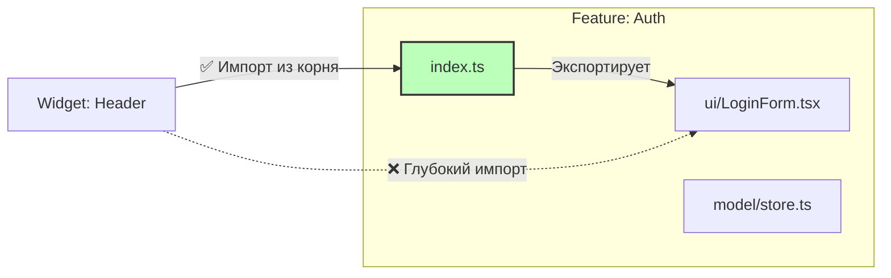

# Public API в Feature Sliced Design

## Суть: Инкапсуляция реализации
Каждый слайс (модуль внутри слоя) должен иметь четкий контракт для взаимодействия с внешним миром — Public API. Роль этого API выполняет файл `index.ts` в корне слайса. Всё, что не экспортируется из этого файла, считается приватным и не может быть использовано снаружи.

Мы решаем боль хрупкого рефакторинга. Если внутренности модуля изолированы, мы можем полностью переписать его реализацию, не боясь сломать остальную часть приложения, пока Public API остаётся неизменным.

## Как это работает на практике
Запрещены "глубокие импорты" (Deep imports). Мы импортируем только по названию слайса.



## Примеры кода

**Антипаттерн: Глубокий импорт**
```ts
// ❌ Плохо: Мы привязались к внутренней структуре фичи
import { LoginForm } from 'features/auth/ui/LoginForm/LoginForm';
import { useAuthForm } from 'features/auth/model/hooks/useAuthForm';
```

**Правильное решение: Импорт через Public API**
```ts
// features/auth/index.ts
export { LoginForm } from './ui/LoginForm';
// Заметьте, useAuthForm НЕ экспортируется — это внутренняя деталь реализации

// Внешнее использование
// ✅ Хорошо: Чистый и стабильный импорт
import { LoginForm } from 'features/auth';
```

## Неочевидные нюансы
- **Barrel Files:** Использование `index.ts` может замедлить сборку или работу TypeScript в очень крупных монорепозиториях из-за циклического разрешения зависимостей.
- **Тестирование:** Внутренние утилиты модуля тестируются локально, но наружу отдаются только публичные интерфейсы. Не пытайтесь экспортировать функции в Public API только ради того, чтобы написать на них юнит-тест из другой папки.
