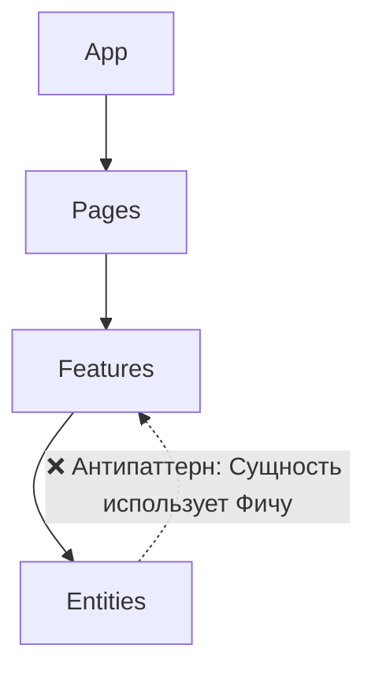

# Антипаттерны Feature Sliced Design

## Суть: Как выстрелить себе в ногу
FSD — это не просто структура папок, это строгий набор архитектурных контрактов. Любое отклонение от них сводит на нет все преимущества методологии и превращает код в переусложненный хаос (Big Ball of Mud в красивой обёртке).

## Главные антипаттерны на практике

### 1. Бизнес-логика в слое Shared
Слой Shared должен быть полностью агностичным (отвязанным от бизнеса). Если проект — это интернет-магазин, Shared ничего не должен знать про товары, корзину или пользователей.
```ts
// ❌ Плохо: Shared знает про домен User
// shared/api/fetchUser.ts
export const fetchUser = () => api.get('/user/me');

// ✅ Хорошо: Логика вынесена в Entities
// entities/User/api/fetchUser.ts
```

### 2. Нарушение потока зависимостей (Upward Imports)
Нижние слои никогда не должны импортировать верхние.


### 3. "Худые" слайсы ради галочки
Создание папок `features/Button` — это классическая ошибка. Фичи и Сущности должны нести ценность. Простая UI-кнопка — это `shared/ui/Button`. Фича — это `features/AddToCart`.

### 4. Кросс-импорты между слайсами
Когда фича `ProductCard` напрямую импортирует фичу `Favorites`. Если они зависят друг от друга, их нужно объединить на уровне Widgets.

## Неочевидные нюансы
- **Прокрастинация архитектуры:** Разработчики могут часами спорить: "Это Фича или Сущность?". Если сомневаетесь — опускайте ниже (в Сущность). Из сущности сделать фичу проще, чем наоборот.
- **Отказ от линтеров:** Пытаться соблюдать правила FSD "на глаз" невозможно. Линтеры (eslint-plugin-boundaries) — это часть самой методологии, а не опциональный инструмент.
