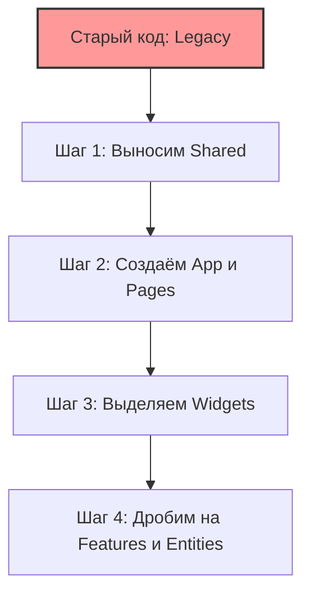

# Миграция на Feature Sliced Design

## Суть: Итеративный процесс
Переписать весь существующий проект на FSD за один раз (Big Bang Rewrite) — это верный путь к провалу. Продукт остановится на месяцы, а в конце вы получите огромное количество багов. Миграция должна быть плавной, инкрементальной и не блокировать поставку новых продуктовых фичей.

Мы решаем боль перехода из хаоса (обычно это классическая структура по типу файлов: `components/`, `hooks/`, `store/`) в модульную систему.

## Как это работает на практике
Стратегия состоит в том, чтобы зажать старый код "в тиски" между самыми нижними и самыми верхними слоями FSD, постепенно распутывая середину.



## Примеры плана миграции

**Шаг 1: Подготовка фундамента (Shared)**
Выносим все "тупые" UI-компоненты (кнопки, модалки), хелперы и инстансы Axios в `shared/`. Это самая простая часть, так как эти файлы ни от чего не зависят.

**Шаг 2: Формирование каркаса (App и Pages)**
Настраиваем роутер и глобальные провайдеры в `app/`. Старые страницы из папки `views` или `pages` оборачиваем в `pages/` по правилам FSD (добавляем Public API). Они могут продолжать импортировать легаси-код.

**Шаг 3: Распутывание клубка (Widgets, Features, Entities)**
Берем одну бизнес-сущность (например, Карточку товара) и начинаем вытаскивать её:
```text
// Легаси
src/components/ProductCard.tsx (внутри тонна логики)

// Рефакторинг
src/entities/Product/ui/ProductCard
src/features/AddToCart/ui/AddToCartButton
src/widgets/ProductList/
```

## Неочевидные нюансы
- **Зона карантина:** Во время миграции старый код помещают в папку `legacy/` или `old_src/` и настраивают линтер так, чтобы из FSD-модулей нельзя было импортировать легаси, но легаси мог использовать FSD.
- **Оверхед по времени:** Команда должна выделять 10-20% времени спринта на технический долг, иначе миграция не закончится никогда.
