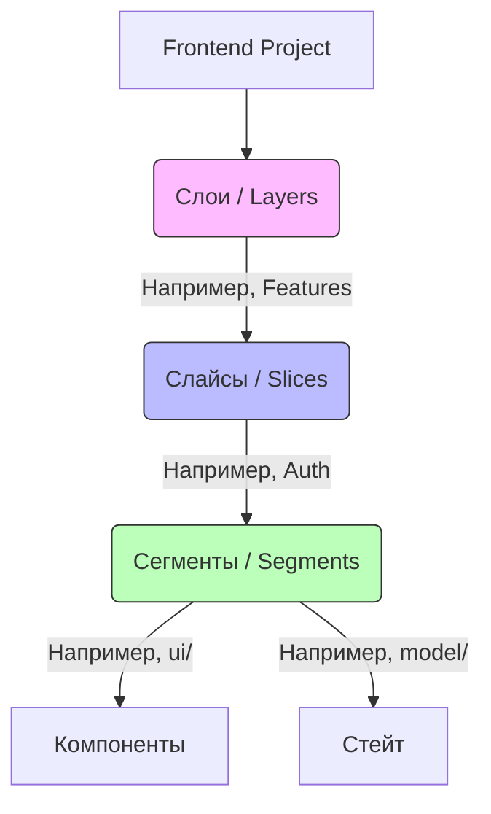

# Основные концепции Feature Sliced Design (FSD)

## Суть: Трёхмерная архитектура
Feature Sliced Design — это архитектурная методология, которая предлагает единый язык и строгие правила для организации Frontend-проектов. Она решает боль "где мне найти этот код" и "почему изменение одной кнопки ломает авторизацию".

Методология строится на трёх ключевых столпах (иерархиях абстракций):
1. **Слои (Layers)** — уровень ответственности (насколько код близок к бизнесу или к UI).
2. **Слайсы (Slices)** — предметная область или бизнес-домен (о чём этот код: о пользователе, о корзине, о статье).
3. **Сегменты (Segments)** — техническое назначение (это UI-компонент, запрос к API или Redux-стор?).



## Как это работает на практике
Вместо привычной группировки по типу файлов (`/components`, `/reducers`, `/hooks`), мы группируем код по смыслу. Открывая папку `features/auth`, разработчик видит сразу всё, что связано с авторизацией: и компоненты, и хуки, и API.

## Примеры кода
**Классическая структура (Антипаттерн для больших проектов):**
```text
src/
  components/
    UserCard.tsx
    AuthForm.tsx
  store/
    userSlice.ts
    authSlice.ts
```

**Структура FSD (Правильное решение):**
```text
src/
  entities/
    User/
      ui/UserCard.tsx
      model/store.ts
  features/
    Auth/
      ui/AuthForm.tsx
      model/store.ts
```

## Неочевидные нюансы
- **Высокий порог входа:** Новым разработчикам требуется время, чтобы понять терминологию FSD. Без хорошего онбординга люди начинают писать код как привыкли, нарушая архитектуру.
- **Многословность:** FSD требует создания множества папок и файлов (включая `index.ts` для Public API), что может раздражать при разработке небольших фичей.
