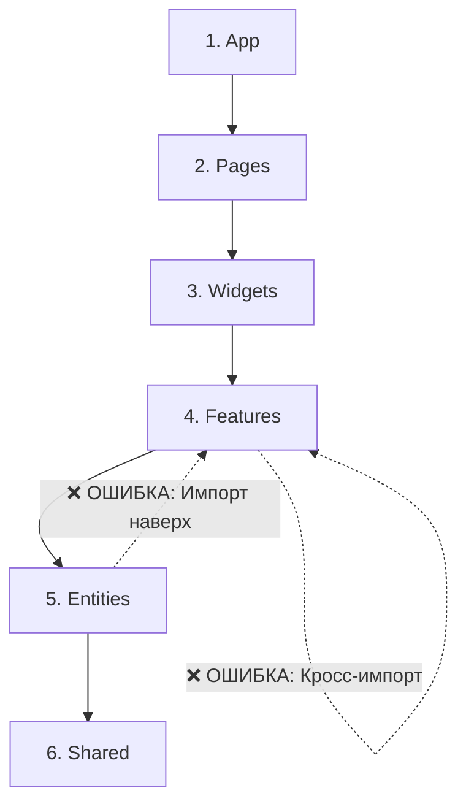

# Правило импортов в FSD (Направленность зависимостей)

## Суть: Зависимости текут только вниз
Самое главное и нерушимое правило Feature Sliced Design — строгая однонаправленность импортов. Модуль из любого слоя может импортировать модули только из слоёв, которые находятся **ниже** него по иерархии.

Мы решаем боль запутанных, циклических зависимостей (когда A зависит от B, а B зависит от A). В проектах без этого правила рано или поздно наступает момент, когда удаление одного файла ломает весь проект по цепочке.

## Как это работает на практике
Иерархия слоёв (сверху вниз):
`app` -> `pages` -> `widgets` -> `features` -> `entities` -> `shared`.



## Примеры кода

**Антипаттерн: Импорт из верхнего слоя**
```ts
// ❌ Плохо: Сущность User не должна знать о существовании Фичи Auth
// entities/User/ui/UserCard.tsx
import { LogoutButton } from 'features/Auth';

export const UserCard = () => (
  <div>
    <Avatar />
    <LogoutButton /> {/* Нарушение! */}
  </div>
);
```

**Правильное решение: Инверсия контроля (Слоты / Children)**
```ts
// ✅ Хорошо: Сущность предоставляет слот, а Фича передаётся сверху (в Widget или Page)
// entities/User/ui/UserCard.tsx
export const UserCard = ({ actionSlot }) => (
  <div>
    <Avatar />
    {actionSlot}
  </div>
);

// widgets/Header/ui/Header.tsx
<UserCard actionSlot={<LogoutButton />} />
```

## Неочевидные нюансы
- **Бойлерплейт со слотами:** Иногда прокидывание React-компонентов через слоты (`actionSlot`, `headerSlot`) кажется избыточным, но это единственный способ сохранить изоляцию нижних слоев.
- **Shared — самый перегруженный слой:** Поскольку Shared находится в самом низу, туда часто начинают скидывать всё подряд (константы, утилиты бизнеса), хотя там должен лежать только код, не привязанный к домену проекта.
