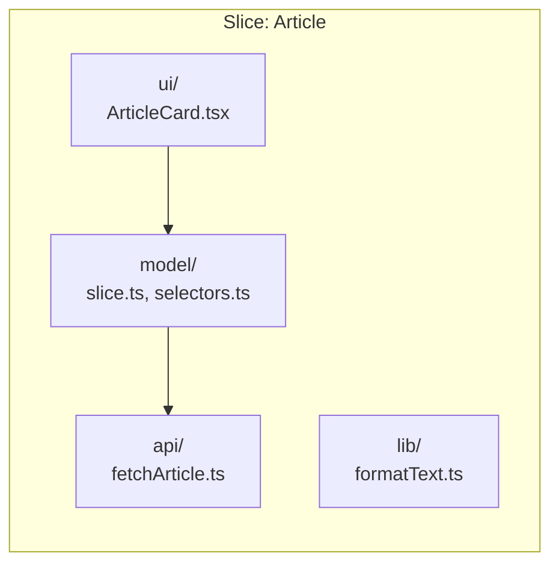

# Сегменты в Feature Sliced Design

## Суть: Техническая группировка внутри бизнес-домена
Если "Слайсы" делят код по смыслу (пользователь, корзина, пост), то "Сегменты" (Segments) делят код **внутри слайса** по его техническому назначению. 

Мы решаем боль навигации внутри крупной фичи. Когда логика фичи разрастается, нам нужно отделить визуальную часть от бизнес-правил и от общения с сервером.

## Как это работает на практике
Сегменты стандартизированы. Обычно в слайсе создаются следующие папки-сегменты:
- `ui` — React-компоненты (или компоненты другого фреймворка).
- `model` — бизнес-логика: стейт (Redux, Zustand, MobX), хуки, контракты данных.
- `api` — логика взаимодействия с сервером (fetch-запросы, RTK Query endpoints).
- `lib` — локальные утилиты, нужные только этому слайсу.



## Примеры кода

**Структура типичного сегментированного слайса:**
```text
src/features/Auth/
├── api/             # Взаимодействие с бэкендом
│   └── login.ts
├── model/           # Состояние авторизации
│   ├── authSlice.ts
│   └── selectors.ts
├── ui/              # Компоненты
│   ├── LoginForm/
│   └── LogoutButton/
└── index.ts         # Public API
```

**Антипаттерн: Каша внутри слайса**
```text
// ❌ Плохо: Отсутствие сегментов
src/features/Auth/
├── LoginForm.tsx
├── authSlice.ts
├── api.ts
└── helpers.ts
```

## Неочевидные нюансы
- **Необязательность сегментов:** Не нужно создавать пустые папки `api` или `model`, если в фиче есть только UI. Сегменты создаются только по мере необходимости.
- **Взаимодействие сегментов:** Внутри одного слайса сегменты могут импортировать друг друга (обычно `ui` использует `model` и `api`), но наружу (в Public API) отдаётся строго ограниченный набор сущностей.
