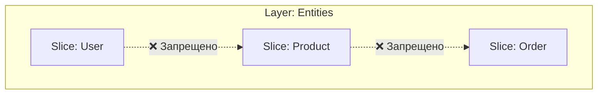

# Слайсы (Slices) в Feature Sliced Design

## Суть: Группировка по бизнес-домену
Слайсы (Slices) — это модули, на которые дробится слой (например, слои Features, Entities или Widgets). Слайс всегда отвечает на вопрос **"О чём этот код?"** (домен приложения).

Мы решаем боль размазывания одной бизнес-функции по всему проекту. При классической архитектуре логика "Корзины" лежит в 5 разных папках (components, hooks, store, types, api). В FSD всё, что касается корзины, лежит в слайсе `Cart`.

## Как это работает на практике
Слайсы находятся на одном уровне иерархии (внутри слоя) и **не могут импортировать друг друга** (правило запрета кросс-импортов). Каждый слайс — это изолированная, независимая предметная область.



## Примеры кода

**Антипаттерн: Технический нейминг слайсов**
```text
// ❌ Плохо: Слайсы названы по типу содержимого, а не по бизнес-смыслу
src/
  features/
    Forms/     <-- Это не домен
    Buttons/   <-- Это UI-кит (должно быть в Shared)
    Helpers/   <-- Это утилиты
```

**Правильное решение: Доменный нейминг**
```text
// ✅ Хорошо: Понятно, какие функции есть в приложении
src/
  features/
    Auth/
    AddToCart/
    WriteComment/
```

## Неочевидные нюансы
- **Сложность выделения домена (Bounded Context):** Самая сложная часть FSD — правильно нарезать слайсы. Являются ли `Article` (статья) и `Comment` (комментарий) одним слайсом или разными? Если комментарии могут быть не только у статей (но и у фото или товаров), то это разные слайсы.
- **Переиспользование логики:** Если двум слайсам из слоя `Features` нужна общая логика, её нельзя передать напрямую. Приходится спускать эту логику на слой ниже (в `Entities` или `Shared`), что иногда ощущается как излишнее дробление (Overengineering).
