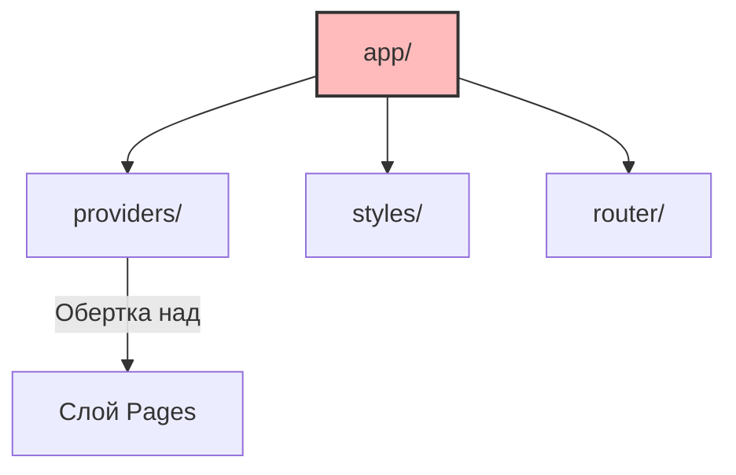

# Слой App (Приложение) в FSD

## Суть: Точка входа
Слой `app` — это самый верхний уровень архитектуры Feature Sliced Design. Он является точкой входа (entry point) в приложение и отвечает за инициализацию всей системы. 

Мы решаем боль разбросанных по проекту глобальных настроек. Все провайдеры (Redux, Theme, Router), глобальные стили и базовая разметка хранятся в одном месте.

## Как это работает на практике
Слой `app` ничего не знает о бизнес-логике. Он собирает приложение из нижележащих слоев (в первую очередь, из слоя `pages`).



## Примеры кода

**Антипаттерн: Бизнес-логика в App**
```tsx
// ❌ Плохо: App сам делает запросы за пользователем
const App = () => {
  useEffect(() => {
    fetch('/api/me');
  }, []);
  
  return <Router />;
};
```

**Правильное решение: Чистый слой инициализации**
```tsx
// ✅ Хорошо: App просто настраивает среду
// app/providers/with-store.tsx
export const withStore = (component: () => React.ReactNode) => () => (
  <Provider store={store}>
    {component()}
  </Provider>
);

// app/index.tsx
import { Routing } from 'pages';
export const App = withProviders(Routing);
```

## Неочевидные нюансы
- **Разбухание провайдеров:** Если провайдеров много (Store, Theme, I18n, ErrorBoundary), `app/index.tsx` превращается в "ёлку" (Callback Hell). Используйте паттерн compose/withProviders для их плоского объединения.
- **Ограниченность слоя:** В слое `app` не должно быть UI-компонентов, кроме корневого лэяута и глобальных лоадеров/ошибок.
