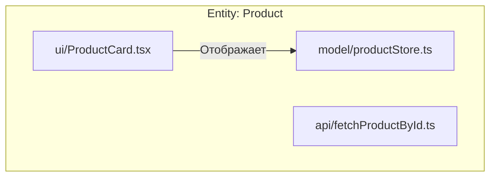

# Слой Entities (Сущности) в FSD

## Суть: Бизнес-объекты без действий
Слой `entities` содержит фундаментальные сущности предметной области: "Пользователь" (User), "Товар" (Product), "Статья" (Article). Это каркас бизнес-логики.

Мы решаем боль "размытия" бизнес-моделей. В классической архитектуре типы данных и базовые UI-компоненты товаров лежат в разных местах. В FSD они инкапсулированы внутри сущности.

## Как это работает на практике
Сущность умеет отображать себя (UI), хранить свои данные (Model) и запрашивать их с сервера (API). Но **сущность не совершает активных действий**. Кнопка "В корзину" — это фича, а сама карточка товара с названием и ценой — это сущность.



## Примеры кода

**Антипаттерн: Сущность берёт на себя функции Фичи**
```tsx
// ❌ Плохо: Карточка товара сама умеет добавлять себя в корзину
// entities/Product/ui/ProductCard.tsx
export const ProductCard = ({ product }) => (
  <div>
    <h2>{product.name}</h2>
    <button onClick={() => api.addToCart(product.id)}>В корзину</button>
  </div>
);
```

**Правильное решение: Сущность делегирует действия через слоты**
```tsx
// ✅ Хорошо: Сущность отвечает только за отображение
// entities/Product/ui/ProductCard.tsx
export const ProductCard = ({ product, actionSlot }) => (
  <div>
    <h2>{product.name}</h2>
    <p>{product.price} ₽</p>
    {actionSlot} {/* Сюда Фича прокинет свою кнопку */}
  </div>
);
```

## Неочевидные нюансы
- **Слоты vs Props:** Иногда вместо `actionSlot` разработчики передают функцию `onActionClick`. Это нарушает инкапсуляцию, так как верхний слой вынужден сам рендерить кнопку вместо Фичи. Слоты (children) предпочтительнее.
- **Сущности не зависят друг от друга:** Сущность `Order` (Заказ) не должна импортировать `Product`. Если заказу нужен продукт, их нужно связывать на уровне выше (например, в фичах или виджетах).
