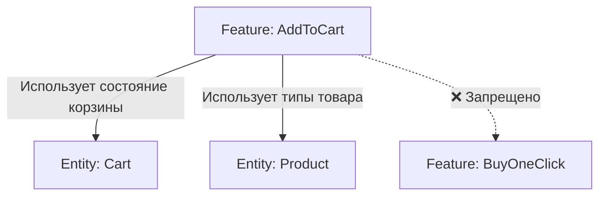

# Слой Features (Фичи) в FSD

## Суть: Взаимодействие с пользователем
Слой `features` отвечает за бизнес-ценность приложения — то есть за действия, которые может совершить пользователь. "Авторизация", "Добавление в корзину", "Написание комментария", "Поиск" — всё это фичи.

Мы решаем боль запутанной бизнес-логики. В фиче инкапсулирован весь код конкретного юзкейса: от UI-кнопки до отправки запроса на сервер и обновления Redux-стора.

## Как это работает на практике
Фичи находятся над сущностями. Они импортируют `entities` (сущности) и добавляют к ним интерактивность. Самое важное: **фичи не могут импортировать другие фичи**.



## Примеры кода

**Антипаттерн: Фича как страница**
```tsx
// ❌ Плохо: Фича берет на себя слишком много и верстает всю форму
// features/Auth/ui/AuthForm.tsx
export const AuthForm = () => (
  <div className="page-layout">
    <h1>Вход в систему</h1>
    <input type="text" />
    <button>Войти</button>
  </div>
);
// Фича должна быть переиспользуемым блоком, а не страницей.
```

**Правильное решение: Компактная фича, обертывающая сущность**
```tsx
// ✅ Хорошо: Фича возвращает только интерактивный элемент
// features/AddToCart/ui/AddToCartButton.tsx
export const AddToCartButton = ({ productId }) => {
  const dispatch = useDispatch();
  
  return (
    <button onClick={() => dispatch(addToCartThunk(productId))}>
      Добавить в корзину
    </button>
  );
};
```

## Неочевидные нюансы
- **Синхронизация фичей:** Если фиче "Отправка сообщения" нужно очистить форму после отправки, а форма лежит в другой фиче, мы не можем вызвать метод напрямую. Взаимодействие должно идти через глобальный стейт (или Event Bus) на уровне выше.
- **Микро-фичи:** Не нужно создавать слайс-фичу ради одной функции форматирования телефона. Фича должна нести осязаемую ценность для пользователя.
