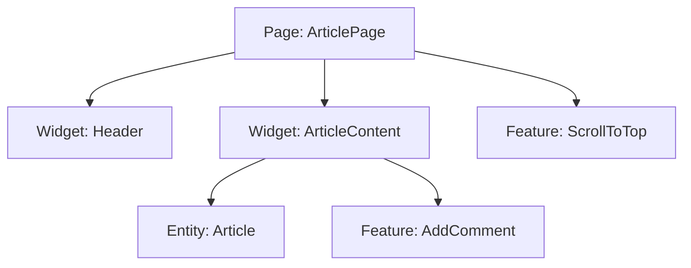

# Слой Pages (Страницы) в FSD

## Суть: Сборка экранов
Слой `pages` (Страницы) — это композиционный слой, который собирает воедино кусочки из нижележащих слоев (Widgets, Features, Entities, Shared) для отображения конкретного экрана (маршрута) приложения.

Мы решаем боль "раздутых контроллеров". Страница не должна содержать сложной бизнес-логики. Её задача — маппинг данных (роутинга) и грамотная компоновка UI-блоков.

## Как это работает на практике
Каждый слайс в слое `pages` соответствует одной странице или группе связанных страниц (например, `pages/Profile`, `pages/Catalog`).



## Примеры кода

**Антипаттерн: Страница с бизнес-логикой**
```tsx
// ❌ Плохо: Страница сама ходит в API и фильтрует данные
export const UserPage = () => {
  const [users, setUsers] = useState([]);
  
  useEffect(() => {
    fetch('/api/users').then(res => setUsers(res.data.filter(u => u.active)));
  }, []);

  return <div className="grid">...</div>;
};
```

**Правильное решение: Страница-компоновщик**
```tsx
// ✅ Хорошо: Страница просто использует готовые виджеты и фичи
import { UserGrid } from 'widgets/UserGrid';
import { SearchUsers } from 'features/SearchUsers';

export const UserPage = () => {
  return (
    <main>
      <header>
        <SearchUsers />
      </header>
      <UserGrid />
    </main>
  );
};
```

## Неочевидные нюансы
- **Кросс-импорты между страницами:** Иногда одной странице нужен кусочек другой (например, контент страницы "Товар" нужно отрендерить в модалке на странице "Каталог"). В FSD импортировать страницу в страницу **строго запрещено**. Общий код нужно вынести в слой `Widgets`.
- **Роутинг:** Сами пути (URL) и объявление роутера обычно находятся в слое `app/providers/router`, а `pages/` экспортирует лишь React-компоненты (часто через `lazy` для code splitting).
