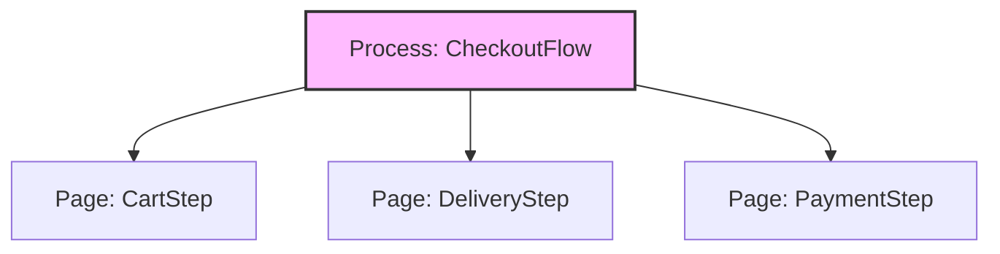

# Слой Processes (Процессы) в FSD

## Суть: Кросс-страничные сценарии (Deprecated)
Слой `processes` исторически задумывался для управления сложными бизнес-сценариями, которые охватывают сразу несколько страниц (маршрутов). Классический пример: многошаговая корзина (Checkout) или онбординг пользователя.

Мы решаем боль размазывания стейта "процесса" по разным страницам. Если процесс регистрации состоит из 3 страниц, кто должен хранить промежуточные данные?

## Как это работает на практике
Слой процессов находится между `app` и `pages`. Процесс может управлять отображением страниц в зависимости от своего внутреннего состояния (State Machine).



## Примеры кода

**Стейт-машина процесса:**
```tsx
// processes/Checkout/model/store.ts
export const checkoutSlice = createSlice({
  name: 'checkout',
  initialState: { step: 1, deliveryData: null },
  reducers: {
    nextStep: (state) => { state.step += 1; }
  }
});
```

## Неочевидные нюансы (Почему слой устарел?)
- **Избыточность:** В 95% случаев многошаговые формы можно реализовать прямо на слое `pages` (через вложенный роутинг) или вынести общее состояние в `entities`.
- **Сложность понимания:** Слой вызывал путаницу у разработчиков (что есть Процесс, а что Фича?). В современной документации FSD этот слой помечен как **опциональный/устаревший (deprecated)**, и использовать его в новых проектах не рекомендуется.
