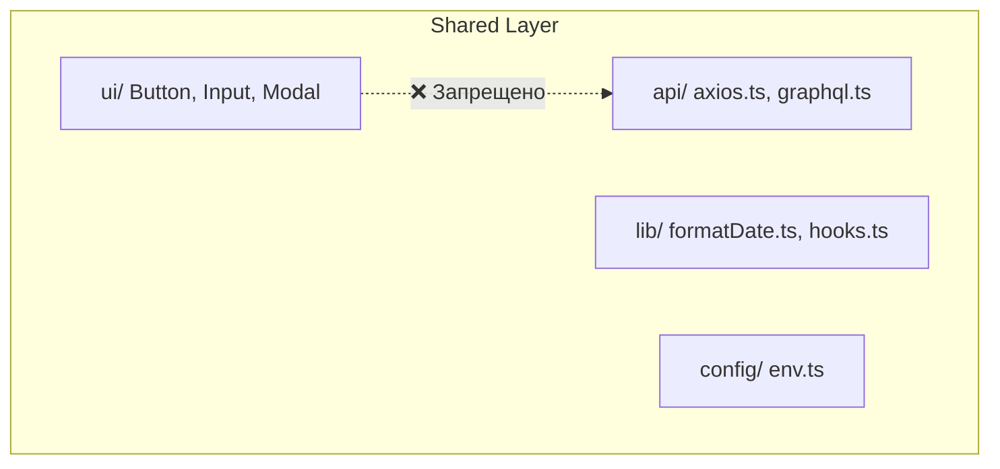

# Слой Shared (Общие компоненты) в FSD

## Суть: Агностичный фундамент
Слой `shared` — это самый нижний уровень архитектуры. Здесь хранится код, который **ничего не знает о бизнес-логике** вашего приложения. Если вы делаете интернет-магазин, в папке `shared` не должно быть слов `Product`, `Cart` или `User`.

Мы решаем боль дублирования базовых вещей. UI-кит (кнопки, инпуты), общие утилиты (форматирование дат), настройки HTTP-клиента (Axios) — всё это должно быть переиспользуемым на 100%.

## Как это работает на практике
Слой `shared` не делится на Слайсы (Slices). Он состоит только из Сегментов: `ui`, `api`, `lib`, `config`. Это единственное исключение в FSD.



## Примеры кода

**Антипаттерн: Бизнес-логика в Shared**
```tsx
// ❌ Плохо: Кнопка знает, что она очищает корзину (Бизнес-домен)
// shared/ui/ClearCartButton.tsx
export const ClearCartButton = () => (
  <button onClick={() => api.delete('/cart')}>Очистить</button>
);
```

**Правильное решение: Тупой компонент**
```tsx
// ✅ Хорошо: Кнопка просто принимает onClick и текст
// shared/ui/Button.tsx
export const Button = ({ onClick, children }) => (
  <button onClick={onClick}>{children}</button>
);
```

## Неочевидные нюансы
- **Свалка кода:** Так как `shared` находится в самом низу и его можно импортировать откуда угодно, разработчики часто начинают лениться и кидают туда всё подряд. Это превращает `shared` в файловую помойку.
- **Внутренние зависимости:** Сегменты внутри `shared` не должны сильно зависеть друг от друга. Если ваш `ui/Button` требует сложной логики из `lib/` или `api/` — скорее всего, вы делаете что-то не так.
