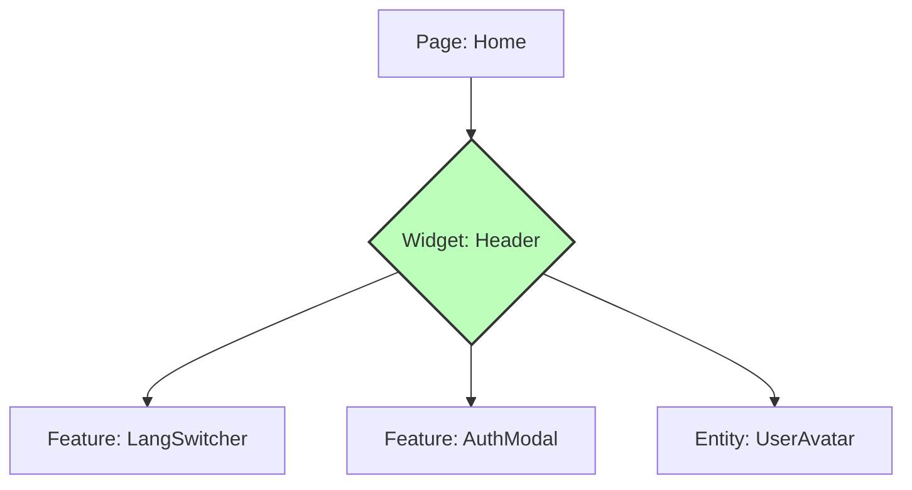

# Слой Widgets (Виджеты) в FSD

## Суть: Самостоятельные блоки интерфейса
Виджеты — это крупные, самодостаточные компоненты, которые собираются из сущностей (Entities) и фичей (Features). Если сущность "Статья" просто отображает текст, а фича "Лайк" просто ставит лайк, то виджет `ArticleBlock` объединяет их вместе.

Мы решаем боль перегруженных страниц (Pages). Страница не должна заниматься детальной версткой, она должна оперировать крупными строительными блоками — виджетами.

## Как это работает на практике
Виджет — это черный ящик для страницы. Страница просто рендерит `<Header />`, а виджет внутри себя сам достаёт текущего пользователя (Entity) и рендерит кнопку логаута (Feature).



## Примеры кода

**Антипаттерн: Виджет с бизнес-логикой**
```tsx
// ❌ Плохо: Виджет сам ходит в сеть и мутирует данные
export const UserProfileWidget = () => {
  const handleSave = () => api.post('/users/update');
  return <form onSubmit={handleSave}>...</form>;
};
// Спагетти! Логика сохранения — это Feature.
```

**Правильное решение: Виджет как компоновщик**
```tsx
// ✅ Хорошо: Виджет собирает UI из фичей и сущностей
import { UserCard } from 'entities/User';
import { EditProfileButton } from 'features/EditProfile';

export const UserProfileWidget = ({ userId }) => {
  return (
    <div className="profile-block">
      <UserCard id={userId} />
      <EditProfileButton userId={userId} />
    </div>
  );
};
```

## Неочевидные нюансы
- **Грань между Widget и Feature:** Часто возникает спор, чем является компонент: большой фичей или виджетом. Правило простое: если блок выполняет *одно конкретное действие* (например, форма оплаты) — это Фича. Если блок содержит *несколько разных действий и сущностей* (Хедер с поиском, корзиной и профилем) — это Виджет.
