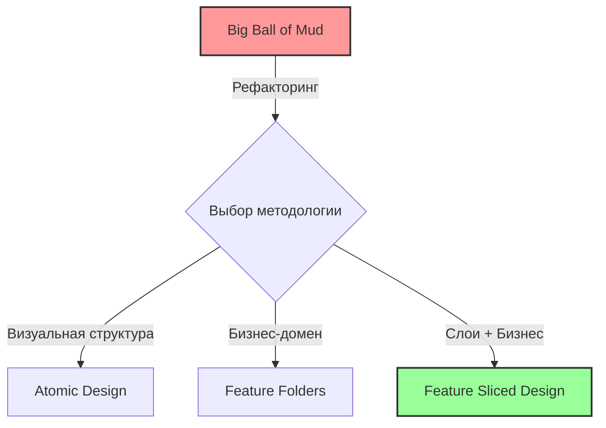

# 04 Методологии организации Frontend-кода

## Суть: Зачем нам правила папок?
Представьте проект, который начался с одной папки `components`. В начале всё было просто, но через год там скопилось 500 файлов. Попытка найти нужную кнопку превращается в археологическую раскопку. Методологии организации кода — это не просто "как назвать папки", это свод правил о том, как компоненты и модули могут зависеть друг от друга, чтобы проект оставался поддерживаемым на дистанции. Мы решаем боль высокой связности (coupling) и низкой сплочённости (cohesion).

## Как это работает?
Вместо свалки мы делим систему на логические блоки. Это может быть архитектура по визуальным слоям (Atomic Design), по бизнес-фичам (Feature Folders) или гибридная система со строгими правилами зависимости (Feature Sliced Design - FSD).

## Нюансы и трейдоффы
- **Оверхед на старте:** Любая методология требует времени на изучение и настройку. Для MVP это может быть избыточно.
- **Риск карго-культа:** Разработчики могут начать дробить код ради структуры, а не ради смысла (создавая пустые файлы или лишние абстракции).
- **Сложность рефакторинга:** Переход с одной методологии на другую (например, с хаоса на FSD) — это болезненный процесс, требующий остановки продуктовой разработки.
