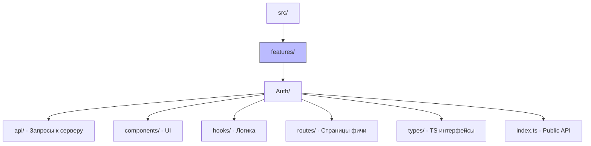

# Bulletproof React (Прагматичная архитектура)

## Суть: Feature Folders на максималках
Bulletproof React (от Alan Alickovic) — это популярный архитектурный шаблон, который берет за основу подход Feature Folders (папки по фичам), но вводит строгие правила для их внутреннего устройства. 

Мы решаем боль запутанности классических Feature Folders, где внутри фичи начинается хаос из-за отсутствия структуры. Эта архитектура проще, чем FSD, но достаточно мощная для крупных энтерпрайз-приложений.

## Как это работает на практике
Проект делится на папки, каждая из которых представляет отдельную фичу. Внутри каждой фичи есть строго определённая структура: компоненты, хуки, API-запросы, типы и роуты этой фичи.



## Примеры кода

**Изоляция фичи:**
Вся логика авторизации лежит в одном месте. Если мы захотим удалить фичу "Auth", нам нужно удалить ровно одну папку.
```tsx
// src/features/auth/routes/Login.tsx
import { LoginForm } from '../components/LoginForm';
import { useLogin } from '../hooks/useLogin';

export const Login = () => {
  const loginMutation = useLogin();
  return <LoginForm onSubmit={loginMutation.mutate} />;
};
```

## Неочевидные нюансы
- **Связанность фичей (Coupling):** В Bulletproof React нет строгих правил слоев, как в FSD (Entities/Features). Из-за этого фича `Article` может напрямую импортировать фичу `User`. При росте проекта это может привести к циклическим зависимостям. Решается через вынос общего кода в папку `src/components` или `src/types` (аналог Shared в FSD).
- **Дублирование:** Иногда сущность разрывается между фичами. Например, типы пользователя могут понадобиться и в фиче "Авторизация", и в фиче "Профиль".
