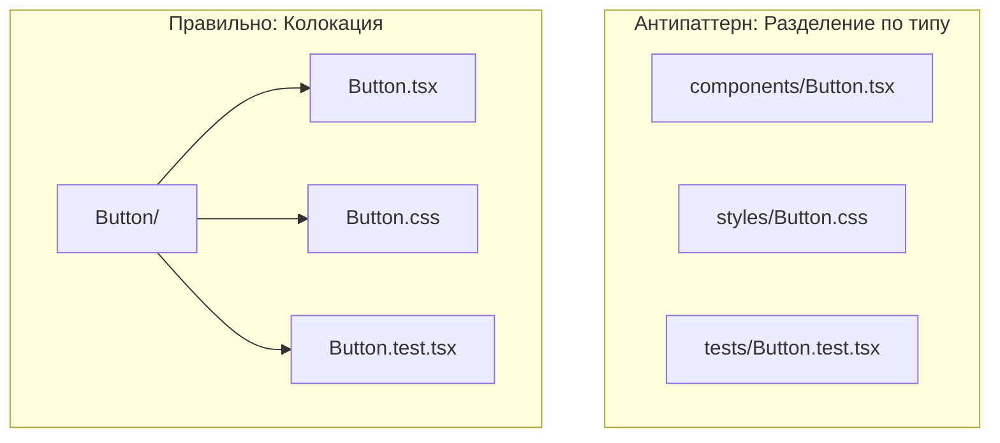

# Colocation (Колокация)

## Суть: Клади рядом с тем, где используешь
Колокация — это принцип организации кода, который гласит: **"Файлы должны лежать как можно ближе к месту их использования"**. Если стили нужны только одной кнопке, они должны лежать в папке с этой кнопкой, а не в глобальной папке `src/styles`. Если хук `useUser` используется только в компоненте `UserCard`, он должен лежать рядом с ним.

Мы решаем боль разбросанного кода. Когда разработчик хочет изменить компонент, ему не нужно бегать по 5 разным папкам (`components`, `styles`, `hooks`, `tests`).

## Как это работает на практике
Вместо группировки по типу файлов, мы группируем по локальности.



## Примеры кода

**Антипаттерн: Глобальные хуки**
```text
// ❌ Плохо: Хук лежит в корне, хотя нужен только одной форме
src/
  hooks/
    useLoginForm.ts
  components/
    LoginForm.tsx
```

**Правильное решение: Локальные хуки**
```text
// ✅ Хорошо: Хук лежит рядом с компонентом
src/
  components/
    LoginForm/
      LoginForm.tsx
      useLoginForm.ts
```

## Неочевидные нюансы
- **Сложность шаринга:** Если локальный хук вдруг понадобился в другом месте проекта, его придётся "поднимать" (lifting) на уровень выше (например, в `src/hooks`). Это требует рефакторинга и изменения путей импорта.
- **Глубина вложенности:** При строгой колокации файловое дерево может стать очень глубоким (например, `src/pages/Home/components/Header/components/Logo/Logo.tsx`), что затрудняет навигацию в IDE.
