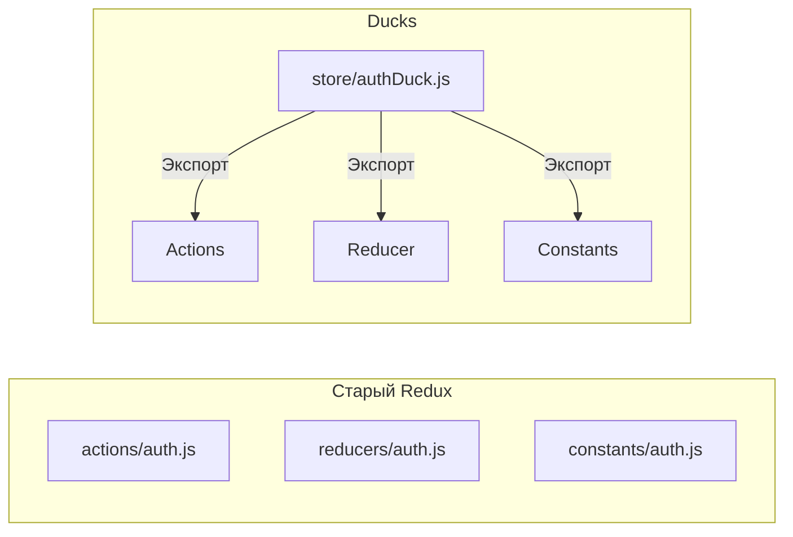

# Ducks Pattern (Паттерн "Утки")

## Суть: Всё для стейта в одном месте
Паттерн Ducks был придуман для Redux-приложений. В классическом Redux разработчиков заставляли создавать 3-4 файла для одного простого действия: `actions.js`, `reducers.js`, `constants.js`, `selectors.js`. 

Ducks предлагает упаковать всё, что связано с одним кусочком состояния (например, `auth`), в **один единственный файл** (модуль).

## Как это работает на практике
Один файл (Duck) экспортирует `reducer` по умолчанию, а все `action creators` и `selectors` — как именованные экспорты.



## Примеры кода

**Классический Duck-модуль:**
```js
// store/widgets.js

// 1. Константы (Actions)
const LOAD   = 'my-app/widgets/LOAD';
const CREATE = 'my-app/widgets/CREATE';

// 2. Редьюсер (export default)
export default function reducer(state = {}, action = {}) {
  switch (action.type) {
    case LOAD: return { ...state, data: action.payload };
    default: return state;
  }
}

// 3. Action Creators (именованные экспорты)
export function loadWidgets(data) {
  return { type: LOAD, payload: data };
}
```

## Неочевидные нюансы
- **Гигантские файлы:** По мере роста логики файл может легко разрастись до 1000+ строк. В таком случае Duck превращают в папку (папка-утка) с колокацией файлов внутри.
- **Redux Toolkit:** Сегодня паттерн Ducks встроен прямо в официальный `@reduxjs/toolkit` через функцию `createSlice()`. Если вы используете RTK, вы уже используете Ducks, просто в более современной форме.
